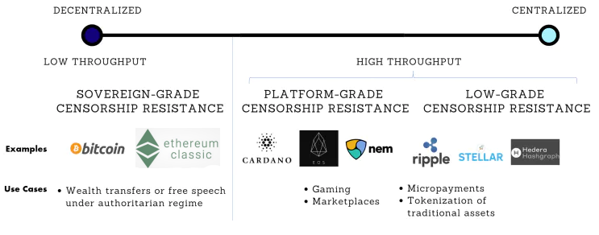
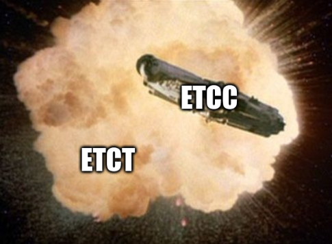
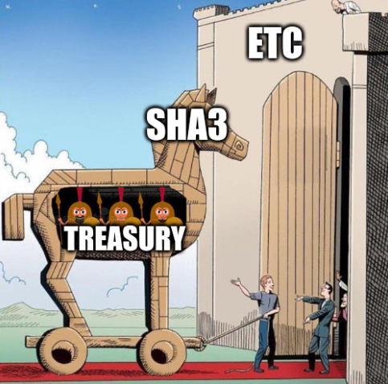

# Let's keep Ethereum Classic *Classic*

Arguing against the proposed protocol-layer treasury for Ethereum Classic

2021.09.04

> We decentralists are committed to keeping blockchains open, neutral and immutable. We’re committed to keeping blockchain systems decentralized. This informs all our actions and positions towards any developments in the crypto world and beyond. All attempts to violate any of the key blockchain characteristics should be fought.

When ETC rose from the ashes of The DAO Hack in July 2016, [A Crypto-Decentralist Manifesto](https://ethereumclassic.org/blog/2016-07-11-crypto-decentralist-manifesto/) was one of the very first items to appear on the [Ethereum Classic website](https://github.com/ethereumclassic/ethereumclassic.github.io-v1/commit/4491ed0471f463ed2e39bdb20bc79fd892a86910) and was a seminal document that laid out ETC's _raison d'être_. We begin with this quote to remind ourselves of where Ethereum Classic came from, where it derives it's value, and what will remain an integral part of it's future.

We recognize that the value proposition of Ethereum Classic is uniquely reliant on a strict adherence to it's core principles, which uphold decentralization. ETC is is presently one of the preciously scarce _truly_ decentralized cryptocurrency projects, and for this reason we believe it's sanctity is worth defending.

The future will rely on truly neutral blockchain platforms like ETC. If they are to remain antifragile and uncaptured by special interests, the principles of decentralization need to be thoroughly, vigorously and relentlessly defended. We say without hyperbole that protecting ETC is protecting the future of humanity; for the greater good, there is no hill more important to die on.

A clear and present threat to the future of Ethereum Classic exists in the form of ECIP-1098, _aka_ The Treasury Proposal. This document will attempt to deconstruct The Proposal in order to preemptively avoid an agonizing chain-split event that is looming on the horizon should it be forced upon us.

*This document is a bit long, so there is a [TL;DR version](#too-long-didnt-read) if you are limited on time.*

## Table of Contents

```toc
exclude: [Table of Contents]
```

## Housekeeping

We hope to spark discussion within the ETC community about the pros and cons of implementing a treasury in order to facilitate consensus creation about whether or not to implement such a proposal. Our only focus is the success of Ethereum Classic and hope to achieve this in the least disruptive way possible.

Whilst lively debate is a healthy aspect of any community we hope that the conversation can remain civil and doesn't cause any significant rifts or rage-quits. As such, before we get in to the meat of the topic, we want to set the tone in what we hope can be a good-spirited exchange of ideas.

### Gratitude

We accept that those advocating for a treasury believe they are acting in the best interests of ETC. We recognize that The Proposal is intended be a way to fund the continued development of the 3 major ETC clients for the purposes to ensuring it's future. Both sides of the debate ultimately want the same thing in this regard.

Moreover, we greatly respect and appreciate the valuable contributions to Ethereum Classic that it's many participants, including The Treasury Proposal Beneficiaries, have made and we wish to see them to continue.

### Conflicts of Interest

We will refrain from singling out the potential financial motivations of _specific_ groups or individuals. Such claims distract from the main debate and are impossible to qualify. Any references made to financial conflicts of interest will apply to _any_ rational actors in similar positions, and are made purely for clinical game-theory analysis purposes. At no point are we suggesting foul play from any real world parties in this regard.

### Sensemaking

There are many different viewpoints among Treasury Beneficiaries and non-Beneficiaries alike; some supporting and some rejecting this proposal. On both sides, there may or may not be financial incentives at play that cause certain viewpoints to be amplified, which may cloud the waters of discussion or create a false sense of consensus. This is true of blockchain communities in general and not specific to this debate.

In this space, the reasoned judgement of individuals of supreme importance; the coming and going of minds is what makes or breaks a project. The strategy of simply "going with the majority" is a recipe for failure (or getting rug-pulled), as knowing what _the majority_ is really thinking is impossible. Regardless of the outcome, conscientious participants have the responsibility to reach their own conclusions rather than going with whatever appears to be the prevailing wisdom.

### Contribute

This document may be updated from time to time and can be contributed to by anyone; if you'd like to add any points or corrections you are welcome to submit a [Pull Request](GITHUB_URL) to the github repository. Beyond that, we hope this message can spread far and wide, so please like, share, subscribe, hit the bell icon and print hard copies out to mail to all your friends and family.

### License

Apart from the images, this document is released to the Public Domain under CC0 (No Rights Reserved) - you are free to copy it, remix it, resell it, do whatever you want with it, and attribution is not required.

## The Treasury Proposal

Originally introduced in August 2020, The Treasury Proposal, most recently known as [Ethereum Classic Improvement Proposal #1098](https://ecips.ethereumclassic.org/ECIPs/ecip-1098) is presented as a way to secure funding for development of Ethereum Classic.

We will first briefly summarize The Treasury Proposal, but we encourage the reader to familiarize themselves with the the implementation details of [ECIP-1098](https://ecips.ethereumclassic.org/ECIPs/ecip-1098), the [treasury smart contract repository](https://github.com/input-output-hk/etc_treasury_system), and dive into some of it's proponents' [arguments in favor](https://medium.com/etccooperative/why-ethereum-classic-should-adopt-a-treasury-34e237fe8129).

### ECIP-1098 Summary

> The primary motives of [The Treasury] is to establish a stable and reliable funding mechanism for independent teams, each of whom are capable of both maintaining core clients and evolving the development of the Ethereum Classic platform [...]

The key implementation details of The Proposal are:

- A "dev tax" will be introduced, whereby 20% of the mining rewards from each block will be diverted away from miners to a special Treasury contract
- The proposed contract will distribute these funds to the following Beneficiaries:
  - 30% to IOHK (Mantis Client)
  - 30% to ETC Labs (Core Geth)
  - 30% to ETCCoop (Hyperledger Besu)
  - 10% to Gitcoin Grants (other projects)
- A "coin vote" mechanism in this contract exists that allows the creation of proposals that can:
  - Add a Beneficiary team
  - Remove Beneficiary team
  - Update addresses for Beneficiary teams
  - Disable the gitcoin grants
  - Disable the whole treasury
- Each of these proposals can only be passed if:
  - At least 35,000,000 (~30% of all) ETC is "locked" for a given proposal
  - Locked ETC is deposited in the contract and cannot be moved for 30 days
  - 51% of the locked ETC must signal support for The Proposal to pass
- A time limit of 5 years is set, after which The Treasury is disabled
- As The Treasury Proposal changes the Ethereum Classic protocol in a non-backwards-compatible way, it's implementation will require a hard fork

### A Moving Target

In this document we will be focusing on the latest publicly available version of The Treasury Proposal (as of September 2021), which has not changed much since it's announcement in 2020. It is likely that new versions are being worked on behind the scenes by Treasury Proponents, which are yet to be released, but we intend to update this document if such updates appear.

Until The Treasury is actually implemented, it is is a moving target and subject to modification, so whilst our current criticisms of some implementation details may become irrelevant for newer versions, our opposition will remain as long as a protocol-layer dev tax remains part of The Proposal.

## Against The Treasury

We believe that there are three main reasons why The Treasury Proposal should be rejected by the ETC community:

- **It goes against ETC's principles**
- **It is unlikely to achieve it's stated goals**
- **It introduces an unfair risk to ETC holders**

With these broad objections in mind, we will attempt to deconstruct The Proposal piece by piece by addressing what we perceive to be a variety of technical, economic, social and philosophical issues. We believe that together these issues far outweigh any potential benefit from introducing such a system, and is very likely to have a net negative effect on Ethereum Classic.

### Why Now?

It is unknown how forcefully The Treasury Proposal will be pushed by it's proponents, but it appears there are significant players supporting it and is being seriously considered by the the community. For this reason, now is the time for it to be strongly rallied against, and why we are publishing this document.

We will address flaws in The Treasury Proposal on multiple levels and shine a light on how it is not just incompatible with decentralist philosophy but is counter-productive, exhibits irreconcilably flawed implementation details, and places the unfair burden of additional risk on anyone invested in ETC.

There may be many stakeholders who discovered Ethereum Classic in recent years and who may not be aware of it's genesis and reason for being, so we also aim to remind everyone involved why ETC is the way it is. For ETC's chain state to remain immutable, so must it's principles.

### Preventing Calamity

Whatever happens, the original Ethereum vision will live on. A version of Ethereum without a the DAO hard fork and without a Treasury will always exist; _Ethereum Classic Classic_ (or whatever it becomes known as) is a guaranteed outcome should a protocol layer treasury be implemented.

With significant push-back from enough ETC stakeholders, the inevitability of a chain-split will become obvious, which will hopefully, but not certainly, be enough for the effort to be abandoned or revised in a way that does not betray ETC's values.

## First, Principles

We begin with what believe are the strongest set of arguments against The Treasury Proposal, which rely on reasoning rather than implementation details or technical issues. Regardless of particularities, protocol-layer mechanisms that aren't trust-minimized go against the core values of blockchains in general Ethereum Classic in particular.

### Decentralization is King

The key value proposition of any blockchain is the extent to which it is trustless, neutral and decentralized. This is in contrast to other more centralized alternatives that offer greater 'efficiency' at the expense of these properties. The full ramifications of achieving 'efficiency' is not always revealed immediately; it often falls into the trap of optimizing for short term gain over long term sustainability.

The [trilemma of Scalability, Decentralization, and Security](https://bitcoinist.com/breaking-down-the-scalability-trilemma/
) elucidates how all blockchains must position themselves in a space that balances these qualities and sacrifice some at the expense of others. We argue that ETC's specific configuration maximizes for decentralization and security, focusing on decentralization and successfully filling a niche in the blockchain market that many other less decentralized projects do not.

Ethereum Classic in particular demonstrates it's commitment to this point of view through it's _founding documents_, which contain explicit references to decentralist philosophy, _lack of central leadership_ which protects it from entire categories of social attacks, and _it's very existence_ which is a response to a centralization risk-on event on it's cousin chain - the The DAO Hard Fork.

### Long Term Time Preference

Given the novelty of blockchain systems and lack of understanding about what makes or breaks them, there are many different competing ideas about how to ensure the long term success of a given project. Longevity is an often overlooked feature of blockchain design and, whilst not necessarily exciting, is of primary importance.

The core argument of this document is that The Treasury represents a shift towards centralization, which might appear to have short term benefits, but will come at the expense ETC's long term sustainability.

As decentralists, we believe that whilst ETC may suffer a relative lack of funding for development compared to other projects, this is a price worth paying and not necessarily a negative. The important factor that allows blockchains to maintain their usefulness over time is the nurturing of a philosophy that perpetuates decentralization and in turn enables longevity.

### The Decentralization Spectrum

We recognize that blockchain longevity is dependant on the degree to which it is decentralized. The logic is simple: if a blockchain is dependant on a central group, it can only last as long as that group lasts. We can quantify decentralization by asking how many actors need to be compromised in order to gain control of a given system.

[](https://onwardlabs.co/blog/the-decentralization-spectrum/)

Many blockchains are centralized as they rely on a small set of individuals or organizations; the more extreme examples being Proof of Authority (PoA) chains such Binance Chain. These chains are inherently limited in terms of longevity by the survival of the group that operates said chain. This clear tradeoff between decentralization and efficiency means that Binance Chain can be ultra scalable and cheap to transact on, but it as the behest of both Binance and any group that can control or manipulate Binance.

### Sovereign Grade Censorship Resistance

On the complete opposite side of the spectrum to PoA, Ethereum Classic in a unique position; it's *maxing-out* of decentralization enables it to provide humanity with long term _sovereign grade censorship resistance_. No force in the universe can take down or manipulate ETC's leadership, because it has none.

Ethereum Classic is even more precious than Bitcoin in one regard; it is still possible that Satoshi Nakamoto comes back and influences decision making for BTC, but for ETC, no such figure exists. Almost every other blockchain project has either known leadership or pseudo-anonymous leaders that could be manipulated, but ETC, the rare and miraculous gift from the heavens that it is, does not, and as such has the rare potential to achieve otherwise unseen levels of decentralization.

The way to leverage this unique situation (which ETC is very lucky to have and why we see The DAO Hard Fork as a moment for celebration as rather than for grievance) is to continually strive for trust-minimization; any decision that does not honour these ideals must be rejected.

The implementation of The Treasury Proposal would create a significant quantitative shift away from decentralization as it would take a previously *neutral to all parties* chain and grant a specific group of individuals an elevated level of privilege as far as the protocol is concerned, resulting in an unarguably more centralized protocol [that is easier to attack socially](#meatspace-capture).

ETC losing it's decentralization would be a tragedy, and would squander a rare gift at a time when humanity really can't afford to.

### Principles over Pragmatism?

Should ETC holders really care about people nerding out about upholding _pompous inconsequential esoteric_ principles? Shouldn't we just be pragmatic rather than clinging on to *vague dogmatic* ideas about decentralization?

Our response to this is that particularly in the case of ETC, pragmatism is downstream of principles. Since day 0 (block 1,920,000), ETC has sold itself on these principles and has attracted it's sizable following primarily because of these principles. Many of the developers and contributors working on ETC are only here because of those goals, and have contributed based on this understanding.

The long term value proposition of ETC, and thus (whether you're a day trader or a long term holder) the source of it's monetary value, is reliant on these principles being respected and maintained. It is the essence of Ethereum Classic, and if abandoned, will be sacrificing not just a significant unique selling point, but it's very soul.

Attacks on the neutrality and decentralization of ETC are particularly egregious as they directly contradict the messaging that has enabled ETC to survive; they break the social contract in the same way that Ethereum's "Build Unstoppable Applications" did when it stopped The DAO.

Because of this, we predict that should The Treasury Proposal be forced ahead, enough of the community will be compelled to respond and to defend ETC's core principles by rejecting the forked treasury version and working on the non-forked *Ethereum Classic Classic*.

Later, we'll go into detail about how things are likely to pan out should a treasury be forced through, but for now we'll lay down the claim that in the case of ETC, because of this potential exodus, it is not pragmatic to implement any protocol layer change that even has the perception of abandoning it's core principles.

Moreover, those principles are in place primarily for pragmatic ends, and we believe that any slight shift away from protocol neutrality is likely to tip the scales and cause the protocol to tumble down the [The Centralization Gravity Well](#the-centralization-gravity-well).

## Broken Promises

To understand what's "wrong" about The Treasury Proposal we just have to look at ETC's founding documents. Back in July 2016 when Ethereum Classic had only existed for a matter of weeks, several important documents appeared that were heralded as a formalization that explained of ETC philosophy. They were posted on early versions of the main Ethereum Classic website and were widely shared and upvoted on Reddit, laying out the rules of engagement for ETC participants.

We a believe that any developments that go against the wording or the spirit of these documents should be opposed and will be recognized as a bait-and-switch that contradicts the advertised and agreed upon social contract for all of it's past and present contributors.

Not only does narrative divergence risk alienating a sizable portion of existing proponents, but it also calls into question the integrity of any other promises that have been made or may be made in the future. This includes those promises embedded in The Treasury itself, such the idea that it is temporary and limited.

We can see that if we disregard the established rules of engagement an important rubicon is crossed that opens the door to the rationalization of just about anything in the name of "rescuing" ETC. If its okay to sacrifice promised neutrality, why not revise the monetary policy, or maybe tamper with problematic transactions?

We anticipate that a critical mass of ETC supporters, both OGs and newcomers alike, will on a personal level feel morally obliged to not break their promises and, if the time comes, will support whichever side of a chain split that continues to uphold them.

As history has shown, broken promises lead to chain splits.

### The Ethereum Classic Declaration of Independence

We will first take a look at _the_ founding document of ETC; the so called "[Declaration of Independence](https://ethereumclassic.org/ETC_Declaration_of_Independence.pdf)". As ETC is decentralized, there are no _official_ endorsements that can be made on behalf of the protocol or community, but given it's universally agreed upon spirit at the time of the Hard Fork, this is probably the closest thing ETC will ever get to an "official" stance.

The document holds not just as a point of reference but as a social contract; all participants since it's publication (i.e. from just about day 0 of ETC), can expect to contribute based on the understanding laid out in this declaration. As such, any attempt to betray these values discredits the past contributions that made ETC what it is today - be it CPU cycles, code commits, blog posts, comments, tweets, memes, money, or whatever.

The Declaration begins:

> We believe in a decentralized, censorship-resistant, permissionless blockchain

These are the desirable properties of any blockchain; they are primary, and are at the heart of Ethereum Classic.

The pure **decentralized** nature of ETC will be abandoned if a treasury is implemented, as it will mean that a new class of participants will have an elevated status compared to other parties. Unlike miners, which is a special class but is entirely generalized and open to anyone with enough hashrate (decentralized), a hard-coded set of treasury addresses 'locks in' a selection of _specific parties_ that will gain special privilege and influence (centralized).

This has knock on effects with regards to **censorship-resistance**, as a newly minted special class of treasury Beneficiaries have a significant and disproportionate say in what happens to the protocol, and can interpret what kind of "censorship-resistance" is important. The chain will, due to being inextricably linked to these entities, inherit the sociopolitical influences these organizations will necessarily be under, reducing the chain's ability to resist external demands for censorship.

A situation like _The DAO Fork_, for example, which is the prime example of a lack of censorship-resistance, is clearly more likely and possible to happen if the hard-coded treasury Beneficiaries collude; either by mutual interest of external threats. The beauty of ETC as it stands now is that there are no 'owners' or 'directors' of the protocol, and any such social attacks that threaten the sanctity of the ledger are easily repelled by it's toxic, lovable, but most importantly decentralized community.

**Permissionlessness** is also directly attacked by The Proposal, by definition, by baking in a 'permissions system' for managing Treasury Beneficiaries. [We'll look into the details](#coin-votes) of this later on, but needless to say the implementation of a treasury will cross an important threshold in a significantly _less permissionless_ direction.

> We believe in a strong separation of concerns, where system forks of the codebase are only possible, when fixing protocol level vulnerabilities, bugs, or providing functionality upgrades.

Here we see that The Declaration of Independence directly forbids the implementation of The Treasury Proposal. It is not fixing a vulnerability or bug, and is not providing what can be reasonably defined as a _functionality_ upgrade, as explained:

> forks and/or changes to the underlying protocol shall only be permitted for updating or upgrading the technology on which Ethereum Classic operates

In the same way that The DAO Hard Fork was not *upgrading the technology*, which led to (and so must fall under the definition used by) The Declaration, we argue that The Treasury Proposal will not *upgrade the technology*; both The DAO Fork and The Treasury are purely socially motivated rather than providing technical benefits, and are not permitted according to ETC's lore.

It could be argued that ensuring the funding of core developers will eventually translate into a technical benefit down the road, but the same can be said for The DAO Hard Fork. A major factor in why The DAO Hard Fork was pushed for is the same for The Treasury Proposal; for the financial interests of a group of core developers.

> internal project development can be funded by anyone, whether via a trusted third party of their choice or directly, using the currency of their choice on a per project basis and following a transparent, open and decentralized crowdfunding protocol

This is another section of The Declaration that clearly and explicitly rules out what is being proposed by ECIP-1098; The Treasury is far from what is described as a "transparent, open and decentralized crowdfunding protocol", which refers specifically to *crowdfunding*, a commonly understood voluntary application-layer fund-raising mechanism, not a protocol layer dev tax.

> We encourage that these principles not be changed via edict by any individual or faction claiming to wield power, authority or credibility to do so.

We are reminded that proposals such as The Treasury were expected to arise eventually; the potential rewards are obvious and it is human nature to gravitate towards such solutions.

> We likewise will openly resist the “tyranny of the majority,” and will not allow the values of the system to be compromised.

Here we reinforce the intention of resisting any change that is pushed on the community without it's overwhelming support. Then as today, any unilateral action from tyrannical majority should expect to inflict a chain split.

### A Crypto-Decentralist Manifesto

Arguably the _second closest to official_ description of ETC values is "[A Crypto-Decentralist Manifesto](https://ethereumclassic.org/blog/2016-07-11-crypto-decentralist-manifesto/)", by Arvicco, an ETC OG and serial contributor during the _very_ early days.

As with _The Declaration_, _The Manifesto_ was posted and widely shared in the ETC community and it provides further clarity by elaborating on the important idea of _protocol neutrality_. Neutrality and decentralization are pretty much synonymous; you cannot really have one without the other.

If The Declaration is the _why_ of ETC, then The Manifesto is the _how_, and provides some very specific guidance that is designed to keep ETC decentralized for a long period of time by signaling a strong stance against any potentially centralizing developments.

It begins:

> Not all blockchains are created equal. There are three key characteristics, that make scalable blockchain-enabled cooperation possible: openness, neutrality and immutability.

The document proposes that the secret of maintaining the previously described "decentralized, censorship-resistant, permissionless" ETC blockchain is by utilizing three new characteristics - "openness, neutrality and immutability".

At first glance it might appear that The Manifesto is simply rehashing The Declaration by using slightly different wording, but our interpretation is that these new characteristics are guidelines or instructions rather than outcomes themselves. In the same way a person must *exercise, sleep and eat well* to *maintain their health*, a blockchain must be *open, neutral and immutable* in order to *be decentralized, censorship-resistant and permissionless*.

These are, in our opinion, three pillars that give rise to blockchain utility and longevity.

> Neutrality is necessary.

Necessary is a strong word. We see that _The Manifesto_ and the participants who agree with it argue that neutrality is a prerequisite; it is non-negotiable and should be prioritized.

> It’s important for anyone participating in blockchain-enabled cooperation to be on an equal footing with everyone else.

Here we get a precise definition that strikes a fatal blow to the very concept of a protocol layer Treasury. The idea that all participants are _on equal footing with everyone else_ is incompatible with any system that elevates some individuals or groups over others.

Remember that we are concerned here only with protocol design. Anything that happens *on* chain (above the protocol, in the application layer) is governed by individuals' voluntary interaction via *code is law*, following contract code that can be neutral or not depending on the application. In order to uphold *code is law* itself, the protocol itself must be be neutral.

Also note that protocol neutrality is entirely compatible with mining, where there are no non-neutral built-in assumptions about _who_ is receiving the block reward. The protocol just objectively dishes out a reward based on whoever is able to provide hashes; all parties are treated equally in this regard. This type objective neutrality is impossible to achieve when dealing with the fuzziness of rewarding development or other "meatspace" concerns. To keep the protocol neutral, it must not implement an inherently subjective system such as a Treasury.

> The rules of the game are exactly the same for everyone, period.

Reiterated, once again, is the importance of protocol neutrality. We believe that because The Treasury directly contradicts *The Manifesto*, for this reason alone it is a non-starter.

> Without neutrality, the system is skewed towards one set of participants at the expense of others. In that case, it’s less likely to gain universal acceptance and maximize network value for everyone.

While The Manifesto doesn't drill into the ins and outs of how you get from *less neutrality* to *less universal acceptance and network value*, the link is made, and we will explore this idea in a [later section](#protocol-neutrality). For now, we'll just point out that even (or perhaps especially) back then, it was recognized that neutrality is a fundamental requirement.

> The rules governing the blockchain network are known in advance. They’re exactly the same for everyone and not subject to change other than with 100% consensus. Yes, it must be 100%. Because any change to the system’s rules that not all participants freely agree to creates a network split, diminishing network value for everyone.

This section highlights the major reason why should be incredibly cautious about pushing for a controversial proposal, and is the main motivation for us to raise the alarm bell by writing this piece: the risk of a chain split.*The Manifesto* correctly points out that even a small minority of dissent will result result in a chain split, an outcome we see as being all but certain in this case.

A chain split is obviously a *big kahuna* event and is, to say the least, usually something that participants in a blockchain project try to avoid. If it is absolutely necessary, such as in the case of ETC's creation, then sometimes they can be positive events, but we [argue in a later section](#ethereum-classic-classic) that at this juncture it would lead to a tumultuous outcome that can only be avoided if The Treasury Proposal in it's current form is significantly revised or abandoned.

> It’s impossible to achieve these blockchain characteristics without the system being truly decentralized. If any aspect of the blockchain system becomes subject to centralized control, this introduces an attack vector enabling the violation of one or more of the key blockchain characteristics. It may be possible to limit participation (such as by enforcing AML/KYC rules), thus violating openness. It may be possible to enforce discriminatory policies (such as by filtering “illegal” transactions), thus violating neutrality. It may be possible to rewrite the history of events (such as by confiscating or “redistributing” funds), thus violating immutability. Introducing centralized choke points creates a precondition for the introduction of “blockchain intermediaries or controllers”, who can siphon value out of the system at other participants’ expense.

The implementation of a protocol-level Treasury, as predicted here by *The Manifesto*, will lead to the creation quasi-foundation which will become the arbiter of decision making. Should/can/will the *Ethereum Classic Foundation* be good stewards of the chain they operate? [We explore below](#ethereum-classic-classic).

## The Sinking Ship

What appears to be the strongest argument that is put forth in support for The Treasury Proposal is that without a Treasury, Ethereum Classic will fail. It goes something along the lines of "without a protocol-layer Treasury, ETC development won't be funded, and therefore ETC itself will stop innovating, fade into insignificance or be vulnerable to exploits". ETC is a sinking ship, they say, which can only possibly be saved by changing the rules of the game and redirecting a bunch of money away from mining security to a handful of preordained client developers.

Bologna, say we.

Not only is this argument obviously empirically untrue thanks to the many other examples of successful non-treasury-funded blockchains such as Bitcoin, but it also undermines the achievements and current position of ETC; Ethereum Classic is itself proof that it doesn't need any official development effort or dev tax to reach a multi billion dollar market cap. On the contrary, we believe that ETC's lack of centralization has enabled it's survival.

To work with the metaphor - ETC is not a sinking ship; it's a rocket ship. A rocket ship that's fueled up and waiting for the right weather conditions to blast off to Mars. The last thing it needs right now is to siphon away that fuel by thwacking the side of the rocket with a pickaxe - a move that will most certainly damage the integrity of the ship and ruin it's ability to get to Mars at all.

### An Answer to 51% Attacks?

The first point to make on the topic of *necessity* is that The Treasury Proposal was pushed hardest for in Q3 of 2020 in the midst of a series of worrying 51% attacks against ETC. At the time, these attacks appeared to be an existential threat and many in the community were in panic mode and open to answers - any answers - that would help alleviate this immediate problem.

Luckily, since then, alternatives were mulled and implemented, and since the Thanos upgrade in late 2020, ETC has not been a victim of a successful 51% attack (thanks to all those who worked on Thanos and MESS). MESS is not without controversy and some believe it should be removed, perhaps once ETC becomes the apex predator of Ethash, but that's another topic.

In hindsight, even though The Treasury Proposal was presented as a potential answer, with regards to solving 51% attacks, history has proven it to have not been necessary.

Further contemplation suggests that a treasury is unlikely to be strongly preventative against 51% attacks and could in fact make things worse - by directly taxing the hashrate and thereby making attacks cheaper, as well as the many other indirect drawbacks we're about to dive into.

In this new _post 51% attack_ context, many ETCers have had time to calmly reflect on The Treasury Proposal solution and are now firmly against it as a solution to 51% attacks.

### Move Slowly and Don't Break Things

Critics of chains like Bitcoin cite a lack of rapid development and comparatively little innovation, but we firmly believe that this is a feature, not a bug. During the growth phase that ETC is now in, adoption relies on a solid foundation. Similarly, the underlying protocols of the internet like HTTP and IP didn't need to innovate continually and radically to achieve mass adoption; once deployed, messing with these protocols too much would have risked hampering uptake by breaking compatibility or otherwise increasing friction.

For ETC, too, little innovation happening to the base protocol isn't a bad thing; it is not competing to be "Blockchain 3.0" against the likes of Cardano, Polkadot or Ethereum v2, and plenty of innovation is already happening in the contract layer thanks to Ethereum compatibility. Once Ethereum Mainline descends to Proof of Stake and 2.0, ETC is well positioned to fill the niche of being the "gold old" Trustless World Computer chugging along on the boring old rules that don't change much and are therefore reliably consistent over time.

To reduce friction is to enhance network effects, and to maintain both, blockchains as with the internet protocols should see innovation happen in a layered approach - protocols on top of protocols - like Lightning Network, Optimistic Rollup, DeFi, the IP stack, browsers and websites; increasingly complex applications on top of their largely static protocols. Attempting to push innovation onto an already established protocol (by allocating 90% of all Treasury funding to client development) represents a misallocation and a misunderstanding of where the innovation is going to happen.


If rapid protocol-layer innovation is sought after, there are thousands of other greenfield projects that offer an opportunity to experiment without risking ETC's existing foothold. One of ETC's unique selling points, a rare gem in the blockchain space, is that like it's spiritual big brother BTC, it doesn't require rapid innovation on the protocol layer to cash in on it's main strength of decentralization, which would be traded away by the implementation of a Treasury.

Note that we're not against all protocol innovation - that which is low risk, not controversial, and can be incrementally implemented slowly and methodically without negatively affecting compatibility would be a good place to start, but given ETC's already flexible contract layer, there is no need to jump the gun in the name of protocol-layer innovation, especially if doing so has significant drawbacks.

### Client Development: Essential?

The stated goal of The Treasury Proposal is to fund both client development and the wider Ethereum Classic ecosystem. The Proposal makes the distinction between these two areas, in our view, arbitrarily, to ensure the selection of the the specific Treasury Proposal's Beneficiaries, allocating 90% of all of the funds to these three parties. Three client developers get the bulk of the funds *because* they are maintaining clients, in what we can only interpret as slight-of-hand that elevates the importance client development.

This decision appears to be framed around the idea that client development is the most important or essential element of a blockchain's success, so contributions related to client development should be prioritized above other areas. We believe the question of how to best allocate funds is far more complicated.

It's fair to say that *some* client maintenance is an essential requirement for a blockchain project; without at least one maintained client, a chain either doesn't actually exist (no software) or is open to newly discovered security issues, vulnerabilities or exploits (no maintenance); even if no 'features' are added, new releases will be required periodically to keep up with the ever changing adversities of cyberspace.

Practically, to keep a chain competitive and marketable it may also beneficial to not just maintain a base feature set but also upgrade and expand the functionality of blockchain clients and grow the wider ecosystem; this work is not strictly essential - the chain could technically survive without it - but highly desirable. These "non critical" roles go beyond the basic maintenance of *one* core client and include things like R&D, authoring of ECIPs, client redundancy, community management, marketing, maple syrup, conferences, evangelism, shit-posting, wallet development, dapp development, network monitoring, testing, _etcetera_.

The stated goals and internal logic of The Treasury tells us that it goes beyond the funding of "essential" and into the "nice to have", as it will be funding the development three clients in total. We are told that that it is best to allocate the vast majority of resources to the the teams responsible for the development of additional clients rather than towards other potentially far more important areas. As we [elaborate on later](#non-essential-workers), we believe this is a serious misallocation.

For now we just wish to dispel the idea that "client development" is the same thing as "essential development"; very quickly, client client development goes beyond the point of core maintenance requirements, and should not necessarily be elevated above other types of contributions or parties as it is in the current model.

### No Premine

Some say that in fact ETC _is already_ relying on a treasury or sorts, or at least centralized funding that is running out and needs to be replaced. This is partly true, as the ETH premine, some of which (in the form of post-DAO-fork ETC) was [graciously transferred to ETC Cooperative](https://medium.com/@virgilgr/special-projects-announces-donation-to-ethereum-classic-cooperative-e3bc28c95d0) and was in turn to fund development and other ecosystem activity.

Our answer to this is that whilst these funds did lead to valuable contributions to ETC, they represent only a small portion of the total contributions from the plethora of sources that the wider community has provided overall; financially or otherwise. We note that ETC was live and kicking long before this premine was put to use, and ETC would still be alive without it.

We also [later go into](#worse-than-a-premine) some more arguments about why The Treasury and a premine are very different beasts.

### The Gitcoin Bribe

Gitcoin is a third party grants system that exists to fund the development of public goods in the Ethereum ecosystem, and whilst it has it's flaws, it has successfully created an active ecosystem and delivers on it's goals. The Treasury proposes that 10% of the dev tax is allocated to Gitcoin, presumably to be used on ETC-specific grants.

Gitcoin itself is a promising project and we would support initiatives to integrate it with ETC on the application layer, but like The Treasury contract itself, baking in a such a complex, centralized and non-battle-tested system into the core ETC protocol is asking for trouble.

We won't delve deep into the Gitcoin-specific centralization points and pitfalls, other that this: Gitcoin uses Github for user verification. Gitcoin and quadratic funding in general relies on the assumption of sybil resistance to ensure fair allocation of funds (essentially to prevent vote rigging). One of Gitcoin's first line of defence against sockpuppets is to use Github accounts for identity.

This means that Treasury proponents want Github, and ultimately, their owners Microsoft, to have a protocol-level active role in the operation of Ethereum Classic, which strikes us as the antithesis of ETC's reason for being. If this is considered and acceptable standard for Treasury proponents, what kind of future compromises should we expect in other domains?

The (rather insulting) 10% of the proposed tax, as what appears to be a token gesture, that is allocated to Gitcoin grants is in theory supposed be used to fund _all other_ types of ecosystem development that is not handled by three ordained client maintainers. The more cynical have noted that this inclusion may be a way to tempt non-client-development participants into supporting The Treasury with the potential of receiving grant money.

Regardless of whether Gitcoin is seen as acceptable in terms of decentralization, can use it to reveal the (rather convenient) logic of Treasury Proponents: The Treasury will be used for funding all kinds of activities, not just client maintenance, and of these activities, only a tiny fraction should be allocated to anyone other than the three client maintainers. How convenient.

One huge issue with funding these non-essential activities is that it does not come for free - most directly in the form of reducing hashrate by taxing miners. Why should ETC sacrifice _any_ mining hashrate, which is absolutely essential, not just 'nice to have', in exchange for evidently non-essential activities.

To go back to the sinking ship metaphor - why cut back on hull reinforcement in order to serve caviar on the life rafts?

## Blockchain Seppuku

Without yet addressing the hard technical problems with The Treasury system, in this section we hope to explain how The Treasury is likely to fail in it's own stated goals of increasing contributions to Ethereum Classic.

We believe that implementing a Treasury will, overall and in the long run, result not in increased contributions but a net reduction of sustainable natural contributions to Ethereum Classic and will be regarded by history as a counter-productive and life-shortening act of self-evisceration. In this section we step through the logic of how this might happen, which we hope can serve as a warning against implementing a Treasury or similar proposals.

### The Three Pillars of Decentralization

Like a real world construction, blockchains rely on interlocking and counter-balancing incentive systems that amalgamate into strong social structures. Messing with the fundamentals of these structures even a little bit can have cascading effects that cause the whole house of cards to tumble.

For this reason we should be very cautious when implementing any protocol change that potentially affects the configuration of a blockchain ecosystem's incentive structure, which has many intricacies depending on the deployment, but in the case of ETC relies heavily it's core pillars of openness, neutrality and immutability.

To mess with these properties is to mess with the structure of ETC itself. Weakening one pillar in even (what appears to be) a small way may cause the system to become unbalanced and collapse.


We believe that a Treasury Proposal in particular will represent (at the bare minimum) a perceived effect on the protocol's level of "openness", "neutrality" and "immutability" in various ways, and risks the unravelling of the system.

We acknowledge that **Immutability** is not brazenly abandoned by The Treasury Proposal as it does not intend to introduce any "surgical irregular state change" in the same obvious way that The DAO hard fork did. However, the idea of _philosophical immutability_ (ETC's _principles_ shouldn't change) is certainly at stake and this type of immutability arguably just as important as it is what upholds the former _applied immutability_ (against irregular state changes).

**Openness** is also reduced as the the ability to become a Treasury Beneficiary is not equal access. Not only is this process unclear as there is no procurement process outlined by The Proposal, but it introduces a necessarily permissioned system, with big whales becoming the new gatekeepers.

The primary pillar that is under attack by this proposal is that of **Neutrality**, which is thrown to the wind as the protocol recognizes a whitelist of special addresses that will become dev tax Beneficiaries.

### Protocol Neutrality

As we noted above, The Manifesto argues:

> It’s important for anyone participating in blockchain-enabled cooperation to be on an equal footing with everyone else.
> ...
> Without neutrality, the system is skewed towards one set of participants at the expense of others. In that case, it’s less likely to gain universal acceptance and maximize network value for everyone.

Unfortunately, no further details are given as to how exactly this is likely manifest, but we will attempt to pick up where The Manifesto leaves off and contemplate how this might happen with ETC.

We argue that the various _attributes_ or configuration parameters that a blockchain can offer will result in it's actual and perceived level of neutrality. A blockchain project can therefore have various different levels of neutrality that will yield varying outcomes in terms of network value and universal acceptance. Neutrality, as with decentralization, can be plotted on a spectrum in a similar way as we did above.

Maximizing acceptance relies on maximizing decentralization, which relies on maximizing neutrality, which is in turn maximized by selecting the relevant attributes of a blockchain protocol. We can interpret the term _unequal footing_ to mean a non-optimal configuration of a protocol's features, in a way that does not maximize neutrality. If a blockchain has features that mean all participants are not treated equally from the point of view of the protocol, it is not neutral.

For a blockchain to be maximally neutral and therefore maximally decentralized, it must avoid baking into the protocol (the _code_) any _specific_ parties who are *special*. Examples of these non-neutral parties include:

- A built in list of validators (PoA)
- Premine recipients
- Pre-selected block reward recipients (e.g. Dev Tax)
- Some kind of transaction approval whitelist

One thing to make clear is the difference between neutrality _in general_ and _protocol neutrality_. In this context, we're not trying to ensure that every party regardless of participation has exactly the same level of influence on ETC. Far from it, different parties should have different types and levels of influence based on the substance of their participation. It is natural that real world entities end up having various different levels of influence, and this is perfectly in line with the concept of protocol neutrality. As long as the protocol does not refer to the identities of these parties and allows anyone to fill the role, the protocol remains neutral.

Examples of protocol-neutral parties with different levels of influence might include:

- Miners
- Developers
- Educators
- Influences
- Improvement Protocol Authors

### An Unequal Footing

If protocol neutrality is sacrificed, this may yield some immediate benefits for specific parties, but we believe the unintended consequences of such changes certainly exist, as flagged by The Manifesto.

We are now in the novel world of blockchain socioeconomics, where decisions about what lines of code to implement intersect with the complexity of markets and memes. Exactly how things pan out is impossible to say with certainty, but we hope to forecast a scenario of what happens when neutrality is sacrificed that is both plausible and reason for concern.

Whilst protocol neutrality itself can be fairly objectively defined as we have done so above, individual participants involved in a blockchain's ecosystem may have different subjective beliefs about what they are willing to accept in terms of centralization tradeoffs.

Individuals, too, will change their mind over time based on real world events. If, for example, a major chain such as Ethereum was pressured by it's leadership to once again tamper with immutability, we may see another generation of participants who are strongly convinced that neutrality is of primary importance, even though it wasn't perceived to be a much of a big deal before. Neutrality refugees will be looking towards chains that represent their newly appreciated understanding. Over time we predict that demand for neutrality will increase as less neutral chains fall victim to centralization.

Many casual participants are purely _in it for the Lambos_ so are completely indifferent to a chain's underlying philosophy; they do not care about centralization at all - like fanboys of Ripple or Binance Chain (not throwing shade, these are just examples of centralized chains). This is true of many traders, who collectively hold assets in all cryptocurrencies, Ethereum Classic included.

ETCian DNA, however, was originally filtered through the The DAO Fork and the egregious lack of protocol neutrality it entailed. We could therefore reasonably assume that ETC has the highest concentration of protocol-neutrality-concerned participants out of all blockchain projects - even more so than Bitcoin in relative terms.

New projects offer a good opportunity to experiment or refine what is acceptable in terms perceived neutrality, but as there is no know way of measuring before hand whether a protocol upgrade is likely to cross the line among it's existing community, we believe that it is better to _err on the side of caution_ rather than placing a bet on the hope that the balance is not tipped and a protocol loses it's appeal.

Because of this, for existing projects, we believe the only responsible approach to neutrality is to try and maximize it at all times. ETC in particular should never attempt to make a change that sacrifices perceived neutrality, as the extent to which it's effects are likely to impact the system are unknown, and compared to most chains, more likely to be fatal.

### Natural vs Artificial Contribution

Software projects in general and public blockchains in particular can receive contributions (development, evangelism, etc.) through various means. One distinction that could be made is that of "natural" and "artificial" contribution types.

Basically, we define _natural contribution_ as contribution to a project that is provided without direct financial remuneration; motivations may be for personal development reasons, philosophical, social, political, indirectly financial ([buy and contribute](#squaring-the-coordination-problem-circle)), etc. This is in contrast to _artificial contribution_ that is made in exchange for funding via a dev tax, a premine, crowdsale, etc; incentivized mercenaries for hire, who are primarily motivated by money and not particularly loyal to any project.

We believe that _natural contribution_ is the lifeblood and key to long term success of any blockchain project; it has some extremely powerful features:

- Most importantly, natural contribution encourages all kinds of contribution and dynamically adapts to changing environments and opportunities
- It is sustainable over the (very) long term via the "buy and contribute" strategy
- Purpose-driven contributions are incentivized in addition to financial rewards, which can attract talent that may otherwise not interested
- Self-selecting participants optimise contributions by utilizing their own skill set as best they know how (as opposed to being misallocated a role)
- Self-reinforcing over time as due to network effects and contributions lead to price increases leading to further contributions
- Antifragile base of contributors are free from central points of failure as they associate in a bottom-up way rather than being directed from the top-down (though independent teams may also form and act in groups or companies)

The primary drawback of natural contribution is that contributions may be unreliable, and if a project is unable to gain enough initial momentum to attract a critical mass of contributions to 'get things going' in it's nascent stages, the risk of the project never getting off the ground remains a possibility. However, once a decentralized project reaches some degree of maturity and independence, it's incentive structure should be self-sustaining and by definition should not need to rely on anything other than natural contribution.

It is in these nascent stages where _artificial contribution_ can be useful for decentralized blockchain projects - they start by bootstrapping with centralized artificial contribution mechanisms, with the goal of shedding this reliance and becoming decentralized so that they can operate indefinitely on natural contributions.

The main limiting factor for artificial contribution is lack of long term sustainability and it's inherent reliance on some degree of centralization. Artificial contributions are necessarily directed by an organizing committee of some sort, which itself has a limited lifespan - a foundation, or company, or whoever controls the stipend.

### Squaring the Coordination Problem Circle

Natural contribution is incentivized not just by passion or street cred in the way that typical FOSS contributors are, but also financially due to the _buy and contribute strategy_, which encourages participants (to the extent that they are on an equal footing) to not only buy into a blockchain (increasing it's security), but also to contribute to the success of a chain in a way they feel will be most effective - in a purely 'selfish' manner in order to increase the value of their holdings.

This, we believe, is the magic at the heart of _truly decentralized_ blockchain projects as it neatly solves decentralized coordination. _Praise Moloch._

This mechanism has subtle but powerful effects and fairly distributes rewards in a decentralized way to those who are willing to take financial risk and/or bring benefit to the protocol in a broad number of ways; any thing that increases the value of the chain will by definition benefit holders of ETC, which can range from making memes to submitting PRs, and other contributions that are impossible to fund artificially.

It is this mechanism that has held ETC and many other blockchain projects together so far and has nurtured an entire decentralized blockchain ecosystem into an eye-wateringly valuable human achievement. Since the Bitcoin genesis block this self-reinforcing mechanism has only gotten stronger over time and created greater incentives to contribute - there is no reason to believe this trend will change as long as the protocol remains neutral.

### Fair Shares

The extent to which the _buy and contribute strategy_ makes sense is directly related to the extent to which a protocol is perceived to be neutral.

To illustrate this, take for an extreme example a very non-neutral protocol configuration; one that is premined by 100%. If close to 100% of the liquid supply of a chain is controlled by a few parties, any participant that _buys and contributes_ has to grapple with the possibility of having their holdings liquidated by 100%; those mega-whales will always reserve the ability to dump their whole stack on the market making the value of the tokens of other contributors worthless. In this case, not only do contributors lose their initial investment but also (and possibly more frustratingly) the time and effort they spent contributing.

The same is true to a lesser extent if we increase the neutrality of a protocol slightly. Let's say instead of a 100% premine, it's a 50% premine. Nothing has fundamentally changed here, the risk is simply is lowered. [We argue](#worse-than-a-pre-mine) that what is true for premines is also true for a dev tax, and is in some ways worse.

Note that we're not suggesting that the only outcome is for mega-whales to dump their *entire* stash as the effect occurs to some extent [whenever a party sells their holdings](#running-the-numbers); when this happens it necessarily reduces the value of everyone else's holdings. If contributors want to minimize their risk and maximize their profits, it is in their interest to contribute to whichever blockchain is the most neutral (all other things being equal).

Contributors understand that it may take a long time before their contributions mature into actual value-add for the network, and the market may take additional time to recognize this and translate this potential value into actual ~~dollar~~ value. For this reason, it's not just *present* neutrality but also *future* neutrality that must be protected in order to convince potential contributors to provide value. Even with a 100% neutral protocol today, no sane contributor would *buy and contribute* knowing that a fork is due tomorrow that will dilute their holdings by 100%.

It is rational to assume that any trend towards a reduction in neutrality opens the door for this continue in the future, which directly reduces the benefit of contributing today.

### Competition for the Neutrality Niche

Blockchain projects do not exist in isolation, and are competing against each other for contributor mind share. All things being equal, we should expect new contributors to make the simple calculation above, act in their rational self interest, and contribute to what they perceive to be the _most_ neutral protocol.

We believe that this phenomena explains why many of the small cap and unfairly distributed blockchains rarely manage to garner enough natural contribution to reach self-sustainability, and why shifting away from neutrality (even a tiny bit) poses a significant risk of being out-competed by other more neutral chains and losing developer mind share in the long run.

Like many systems in nature, winners do not appear immediately and may at any given stage appear to be ahead or behind their competition. In the same way, the quiet importance of neutrality might not be obvious in short run, especially when other chains have lots of bells and whistles generating interest, but in the long run, we believe it will prove be one of (if not, *the*) most important factors in blockchain utility and longevity.

This argument stands independently of whether or not a majority claim that neutrality is maintained; even if a protocol is made to *feel* unfair subjectively to some participants, it is likely that natural contribution will be reduced as contributors migrate to chains that do not feel unfair.

### The Centralization Gravity Well

The hazards of drifting away from neutrality towards centralization might appear to be worth the risk if made in a limited way; the benefit of being able to deploy artificial contributions might outweigh the potential reduction in natural contributions. Granted, there are situations where this may make sense, such as during the bootstrapping of a project.

One way to analyse the problem is to understand the _direction and velocity of travel_ with regards to protocol centralization - is a protocol becoming more or less neutral, and by how much over time?

Different types of centralization have different impacts and are more or less likely to yield negative outcomes. In particular, there are some types of protocol changes that are likely to _feedback on themselves_ and compound to create further centralization over time; they could cause the project to tumble down the _centralization gravity well_.

In this scenario, the negative effects of a non-neutral protocol changes might not appear immediately, but will metastasize over time. As it becomes clear that decisions are being driven (even ever-so-slightly) not by a neutral commitment to the success of the project but to the financial interests of some other group, non-Beneficiary participants become less inclined to contribute, there is less resistance to these types of proposals, centralization is further reinforced, and the cycle repeats.

This centralizing feedback loop roughly works as follows:

1. A problem, weakness or vulnerability is identified (e.g. low hashrate, 51% attacks, lack of development)
1. A group uses the problem to justify the implementation of a protocol change that benefits specific participants over others
1. Beneficiaries receive financial resources giving them the means and motivation to make similar changes
1. Non-Beneficiary participants become dissuaded from participating and sell off their holdings
1. Opposition against similar changes decreases, the protocol loses value, mining becomes less profitable, and the community shrinks leading to less evangelizing
1. Problems arise due to this weaker system
1. Go to step 1, repeat

We believe that a Treasury is a feature that yields this type of centralization; Treasury Beneficiaries will continually secure more and more influence over the protocol, making it increasingly difficult to break the cycle.

### Misallocated Resources

The existing Treasury Proposal rests on the assumption that diverting funds away from mining and using those funds to support "client development" is a more efficient use of resources. In theory this could be true, but we believe that at the very least there is a debate to be had about how Beneficiaries should be selected and what level of funding they receive, such that resources are allocated in the most efficient way possible.

The Treasury Proposal explains that in the interests of simplicity, a three-way split between the existing active client maintainers is a fair enough way to allocate the dev tax for the 5 year duration. Clearly, unless these three dev teams are to provide exactly the same amount of value to ETC, this is bound to create misallocation of resources, and we feel this is something that should at least attempted to be addressed.

There is, for example, no weighting in terms of funding or incentive based on the actual usage of said clients; even if there is extremely low usage of the additional clients (and such do not provide as much value to ETC in return), the maintainers of these clients still receive the same amount funding, which could instead be directed to towards improve the client(s) that are used, or other areas that need funding.

A bigger problem in terms of misallocation is that the price of ETC is guaranteed to fluctuate over the course of The Treasury operating, but the amount of ETC given to Treasury Beneficiaries remains a fixed % of the block reward, meaning they are likely to end up with much greater or much smaller amounts of spendable resources (USD) than they anticipate. [We go into this problem in detail](#etc-not-usd) a bit later when we take a closer look at the details of the proposed contract.

### Perverse Incentives

To reap maximum rewards of Beneficiarydom, it is necessary to keep out new Beneficiaries (other client maintainers who want a piece of The Treasury pie). Financially incentivized and empowered by funds from The Treasury, existing Beneficiaries should be expected to shore up their position by spending funds not only on improving ETC, but more importantly (for them) ensuring they exclusively retain their Beneficiary status. We can therefore expect treasury funds to be spent on PR, advertising, vote buying, kickbacks to influencers, misinformation campaigns, etc; anything that may help maintain their status as Beneficiary and prevent others from becoming one.

In theory, checks and balances should operate as a counterweight and enforce good behavior such that Beneficiaries can only remain in the position if they deliver for ETC. In practice, however, the terms of the contract make this a [practical impossibility](#technical-issues).

The combination of strong incentive, financial means, and uphill battle for de-throning Treasury Beneficiaries means that we are likely to end are likely to end up with a permanent ETC client maintainer _triopoly_ who are in _a race to the bottom_ to contribute as little to ETC itself as possible, instead directing funds towards maintaining their status as Beneficiary and keeping the rest as profit. There is little incentive to over-deliver (or indeed deliver at all) as they all receive a fixed amount of ETC regardless of what they contribute to the protocol; the less they spend (or rather, the more they *pretend* to spend) the better.

### The Client Triopoly

At this point, Treasury proponents may make an argument along the lines of "new client maintainers are free to work on their own client without being in The Treasury, just like they do today without one". This line of thinking is plausible at cursory glance but we have shown that the presence of the dev tax is likely to to disincentivize this kind of *natural contribution*.

On *Ethereum Classic Treasury Edition*, whilst it is true that third party maintainers *could* work on other clients without receiving any dev tax, [as we have explored](#an-unequal-footing), in reality this is very unlikely as the incentives don't line up. It would require that third party contributors are happy with subsidizing Treasury Beneficiaries with their labor, doing the job of client maintenance, with (what should be) their salaries going to the entrenched Treasury Beneficiaries, when they could instead be receiving the fair full value of their contributions by working on another chain.

To remedy (but not cure) The Treasury's entrenchment issues, at the very least there should be a clear set of guidelines to describe what is needed to qualify as a Beneficiary. If the purpose of The Treasury really is to incentivize (diverse) client development, a procurement and tendering process should be outlined, ideally in a way that incentivize the inclusion and recommitment of once popular ETC clients like MultiGeth and OpenEthereum.

Whilst the main justification for implementing a Treasury purports to maintain client diversity, it is reasonable to assume that it may end up having the opposite effect.

### Non-Essential Workers

We also question the logic of over-emphasizing the importance of client maintainers as far as Treasury funding is concerned. The existing selection criteria asserts that The Treasury should prioritize the development of two *specific* additional (and potentially redundant) ETC clients over other potentially much more useful areas, in a similar way to how ETH Foundation grants operate:

- As mentioned, resurrecting popular clients OpenEthereum and MultiGeth
- Critically, ECIP research and engagement arguably the most important activity as client development is downstream of this
- Critical infrastructure such as Web3 endpoints
- Third party audits of the exiting ETC protocol and client codebase  
- Beyond the 10% via Gitcoin (which is just for short term grants), an on-chain mechanism to fund long term contributions from other teams or organizations in the ETC ecosystem that have a track record of delivering; e.g. Commonwealth, authors, evangelists, and other smaller but value-adding ETC participants

We can hear the retorts already: "The three client maintainers will expand operations to do all this". A very convenient answer for the maintainers, but why not, if the goal is for ETC to flourish, create a funding mechanism that is open, transparent, and fair to *all* participants, such as those with a proven track record for providing these services to ETC already?

Because of the complexity and inability for a decentralized blockchain protocol to fairly and efficiently allocate funds due to the many fuzzy and fluctuating factors involved, it is our belief that the only remaining way to handle this is to give *all* participants, including client maintainers, exactly the same amount of funding: zero.

### Worse than a Premine

One argument that may be submitted as proof that a Treasury _does_ align with ETC principles and that our centralization concerns are overblown is that a similar event happened in the past: The ETH premine, which ETC inherited.

We believe this point can be countered in a number of ways - one is by recognizing that the premine could well be considered a catastrophic centralizing event that is still unfolding in ETH land. It may be that this is what enabled The DAO Fork after all, as a major contributing factor was to protect the (disproportionally premined) financial interests of those calling the shots.

In this way we can be glad that Ethereum Classic was able to split away from it's centralized parallel universe, as the premine has relatively little influence on ETC post-fork when ETCians fairly hoovered up the "free money" dumped by ETH whales. Perhaps participants could be forgiven pre-DAO for not recognizing the importance of avoiding centralization, but lessons should be learned from this mistake and the neutrality needle shouldn't move further in the wrong direction if it can be avoided.

But regardless about how we interpret the past, the existence of the ETH premine does warrant discussion, and we believe that a consistent position can be held that accept a premine but rejects a treasury as they represent fundamentally different tradeoffs in terms of neutrality.

The first difference is that, unlike a Treasury, the ETH crowdsale was open and permissionless - open to all and without KYC or whitelists. Anyone could send Bitcoin to a crowdsale address and would later be credited with ETH, fully knowing the terms ahead of time.

Further, Ethereum itself didn't exist before the premine - it was used to bootstrap the project and wasn't changing the rules of anything mid-flight; the premine could be justified with "we need a bit of centralization now, but it will always be decreasing going forward", which was more or less stuck to.

Unlike the ETH premine, as a one off event with a known upfront neutrality cost that would be diluted by block rewards over time, implementing a Treasury at this stage flips the direction and velocity of centralization and opens the door to future taxes, extensions of The Treasury, or similar misplaced changes. A Treasury such as the one proposed is likely to be a _growing_ rather than _shrinking_ type of centralization pressure; it aligns incentives in a way that makes the dev tax at least difficult to remove and at worse destined to increase - to understand why we need only ask: what happens when it is supposed to expire?

### 1,825 Days Later

After 5 years, The Treasury contract reaches it's expiration. It goes poof, and the funding is stopped. The salaries of all the developers maintaining the three ETC clients are gone, they are "fired" by the protocol, and they will sadly have to go back to working on other projects.

It's now game over for ETC because thanks to The Treasury client maintenance competition has gone extinct, no alternative business models are incentivized to emerge, and now funding is cut off from the only remaining client maintainers. Nothing has fundamentally changed from pre-treasury to post-treasury, indeed things have gotten worse as business models haven't been able to adapt to a non-treasury world. Following the logic of implementing a treasury to begin with, ETC is still fundamentally a "sinking ship", but now there's nobody left to rescue it.

It is easy to predict what is really going to happen after 5 years: just like the difficulty bomb, The Treasury will be extended. The salaries of those who get to decide what code is implemented depends on it, after all.

The cynics among us may point out that the "5 years" clause is a bait-and-switch designed to lessen the perceived impact of implementing ECIP-1098, but it is precedent itself that is the problem. We can see that accepting the logic of having a treasury in the first place is to accept that it needs to exist perpetually.

By now we can hopefully see that rather than saving the sinking ETC ship, a treasury introduces the real risk of locking in a growing centralization pressure that eventually leads to it's demise in an avoidable act of _Blockchain Seppuku_.

## The Ethereum Classic Foundation

We have discussed the possible dangers of centralization at a high level and how it can snowball out of control, but how might things look on the ground, specifically in the case of The Treasury? During the "5" years that The Treasury is expected to operate for, what kind of behaviors are likely incentivized by The Treasury system? What is ETC likely to get in for it's money; in return for 20% of block rewards?

One promise The Treasury *will* deliver on is the birth of *The Ethereum Classic Foundation*. Although is unlikely they will adopt this name, the 3 main Beneficiaries of The Treasury will become officially recognized group that by virtue of being hard coded into the protocol itself, and would therefore be even more "official" than the *Ethereum Foundation* is for ETH.

Regardless of the specific individuals that comprise The Treasury Beneficiaries, we will refer to this group as the *The Ethereum Classic Foundation* for clarity, as well as a tongue in cheek jab at the obvious centralization risks created by having an officially recognized group of developers and decision makers for ETC. Many blame the original *Ethereum Foundation* for being ultimately responsible for the DAO Hard Fork, a mistake and system failure that that was only possible due to this centralized authority, incentive structure, and the top-down decision making it enabled.

It is our belief that the centralized nature of the *ETC Foundation* is very similar to the *ETH Foundation*, and as such we should expect that the similar mistakes and failures that this centralization enables are more than likely to occur.

### One Big Happy Family

What currently makes the ETC community unique and interesting is it's lack of central leadership. There's a [social contract](https://medium.com/s/story/bitcoins-social-contract-1f8b05ee24a9) that has so far served ETC well enough to, despite huge opposition, to go from just an idea to a multi billion dollar project. ETC is a top 5 Proof of Work cryptocurrency, and one that is well positioned to become *the* premier Proof of Work Smart Contract chain.

What is the engine that has powered the decision making behind ETC's success so far? If we look at how things work now we don't see any central leadership, there's no foundation, no Vitalik. ETC on a human level appears to be disorganized collection of individuals and teams, and whilst the day to day discourse may appear anarchic, toxic or even antagonistic, this chaos leads to an emergent meritocratic order, a "[do-ocracy](https://wiki.p2pfoundation.net/Do-ocracy)" where the best ideas rise to the top.

Many disparate parties have agreed to rally behind in an intersubjective consensus based on the rules of the game as described by ETC's codebase, which is downstream of principles; to hold ETC is to agree to it's rules, an agreement that is fair, peaceful and efficient due to it's voluntary nature.

Within the ETC ecosystem, the more motived a participant is about a particular issue, the more effort they'll contribute - an effort that is not necessarily tied to any artificial financial remuneration. [As we explored](#an-unequal-footing), it is the existing level playing field that allows for this kind of swarm intelligence to function; the rules of the game encourage this kind of contribution as individuals know they, just as anyone else, can really make a difference if they have the logic and conviction to convince others. We hope that in time our writing serves to prove this point.

### From Meritocracy to Aristocracy

In contrast to how things work now, The Treasury Proposal has the potential to disrupt this intricate game theory incentive structure and cast away the decentralized decision making process that served ETC so far. The creation of a select group of "official" client developer teams will create an obvious central point of decision making. Just as with Ethereum Mainline with respect to The DAO Hard Fork decision, *non-foundation* participants, irrespective of previous commitment or actual ability to contribute, will not be on equal footing in terms of influence on the future of the protocol.

Basically, we anticipate that The Treasury will transform the human layer of ETC from a Meritocracy into an Aristocracy. Influence on the protocol will be exerted more and more by those who are within or connected to The Foundation.

It is true that relevant client maintainers naturally have a strong say in how the protocol develops; they get to decide what code is written into their clients, after all, but this power is limited and tempered by other stakeholders. If a client maintainer implements code that other stakeholders don't want to use, their client becomes irrelevant, so they must ultimately serve the interests of ETC stakeholders.

A Treasury flips the script on this, elevating the position of client maintainers even further into a protocol-recognized "official" class that will solidify an additional level of authority whilst removing the safety valve of independently competing clients. Changes to the protocol coming from these protocol-recognized VIPs will be seen as being "officially" endorsed by Ethereum Classic, which clouds the otherwise neutral decision making capabilities of the project at large and bends the future of the protocol to the will of these maintainers.

### Ulterior Motives

To get a feel for how this might become a problem, consider that whilst Beneficiaries are ostensibly working *only* on Ethereum Classic and in theory care *only* about the success of the ETC network, in reality all individuals and organizations have their own motivations and human nature dictates that they will make decisions that ultimately benefit themselves. The Ethereum Classic Foundation's top down approach means decisions about the future of the protocol may occur that aren't in the best interests of ETC or it's stakeholders.

We urge the reader consider the other potential interests that each of the proposed Treasury Beneficiaries may have - particularly the development of other (potentially rival) blockchains. Whilst there is no evidence to suggest as much, it is possible that Beneficiaries hold hidden agendas, or grand visions of how ETC can live in symbiosis other projects, which may or may not be primarily for the benefit of ETC.

In one completely fictitious scenario, perhaps a client maintainer wishes to use ETC as a means to add extra security to one of their other (in some aspects less secure) blockchain projects by anchoring checkpoints onto ETC. It would be fantastic to be able to trustlessly verify the Proof of Work done programmatically inside this other chain's contract system to resolve chain splits, which isn't practical with the Ethash algorithm. This maintainer now has a hidden motivation to push for a new hashing algorithm that does allow allow work to be programmatically verified, such as SHA3.

The implementation of SHA3 does have pros and cons and there is a perfectly reasonable debate to be had, but due to the status of being promoted by an "official" maintainer with other motivations besides *just* ETC, this previously *equal footing* merit-based position becomes an unfairly *officially endorsed* hidden agenda that will unduly skew decision making about the future of ETC, and muddy the waters of discussion to boot.

It is fruitless to make wild predictions about the motivations of specific parties, but this example highlights the potential for such motivations to exist and we should expect ulterior motives to come from many directions; technically, financially, politically, etc.

To point this out is not to throw shade on proposed Beneficiaries; it is The Treasury system itself and the power it bequeaths that is the problem. No Beneficiary can be expected to operate purely for the interests of ETC; regardless of which Beneficiaries are selected, even with the best intentions, over time, power corrupts and will inevitably be abused to some extent if given the opportunity, which is why the opportunity should not exist.

We see it as a kind of law of nature; centralized decision makers are compelled financially to use whatever influence they are given to protect their own interests whether or not they align with other stakeholders' interests. ETC's very existence is proof of this reality.

### Inherited Reputation

If an official group of client developers become ordained into the protocol layer this will have several implications in terms of reputation management for Ethereum Classic. Having real world agents inextricably linked to the Ethereum Classic protocol creates a new relationship and ethical concerns for all participants.

The Ethereum Classic Foundation will now not only be solely responsible for maintaining Ethereum Classic, but Ethereum Classic will inherit the collective reputation of these maintainers. Should the reputation of any of these maintainers be brought into question by any kind of real world drama (of which history shows there is plenty to around), this will directly and rightfully reflect on the reputation of ETC, which will inherit the negative press. ETC holders will be financially exposed to the behavior of these client maintainers and their (future) staff.

If an employee of one of the official client maintainers behaves badly or otherwise causes trouble in some way, ETC will be directly linked to this and all ETC holders are essentially subsidizing this behavior. Disgruntled employees are to be expected, and may even be incentivized by the opportunity to make a quick profit by intentionally creating drama after shorting ETC.

Not only will this situation create a huge responsibility for maintainers (the future of ETC is now squarely on *their* shoulders), but it will draw intense and relentless scrutiny from what is a notoriously abrasive community that would now feel empowered to make unreasonable demands due to their financial skin in the game. Compared to how things work now, developers and maintainers of all kinds can come and go as they please, owing nothing to other participants. As there is no financial remuneration, there is no expectation from anyone in the community, which gives maintainers freedom and the space to do what they do best.

Even today, without a treasury, ETC participants a notorious complainers; heaven forbid what it'd be like with one.

### Meatspace Capture

The creation of an official set of client maintainers creates an obvious attack vector for sociopolitical attacks from nation states, multinational cartels and other motivated organizations. Be it blackmail, legal threats, bribes or other back-handed and difficult to defend against real world social attacks, the only way to avoid this class of failure is to not have exploitable targets in the first place.

The current situation of not having an official foundation or official _anything_ is one of ETC's major benefits in contrast with Ethereum, which, admittedly or not, is essentially captured by whoever has the ability to twist the arm of Vitalik. The nature of these attacks are difficult to prove, but we believe the only prudent position is to hope for the best and prepare for the worst.

The selection of three client maintainers may, in the eyes of some, provide an adequate level of decentralization to defend against these kind of attacks and safeguard the spending Treasury funds and determining the future of ETC. But we can already see that out of the gate there is an overlap of Treasury Beneficiaries, with the CEO of IOHK, Charles Hoskinson, also being a board member of ETC Coop, meaning that Mr. Hoskinson has influence over 66% of The Treasury funds, and gains an arguably dictatorial role in future decision making. ETC goes from extremely decentralized, requiring external attackers to manipulate an unworkable number of participants, to extremely centralized, as external attackers only need to manipulate *one person* to compromise ETC.

In the eyes of many BTC/ETCers, all chains that have an official maintainers have already realized a centralization failure state, and is simply a matter of time for it to manifest in form of subverted decision making, which is undetectable if applied successfully.

Essentially, this outcome puts all the power back into the hands of whoever controls the traditional geopolitical levers of power. Humanity deserves better than this situation, which was the promise of blockchain, but if we are not careful we will end up with a system worse than the legacy system in that it has the pretense of neutrality.

Again, we can look to Bitcoin, who's success has generated relentless attacks from many angles. It's lack of official Bitcoin foundation or leader has protected the protocol from attacks against entities that could be seen as responsible for it's direction, and it is extremely hardened in terms of philosophy due to a strong adherence to principles. Ethereum Classic would be wise to mimic this strategy, for the sake of longevity.

## No Free Lunch

So far we have discussed the more theoretical arguments against a Treasury, but we will now delve into the some of the clear-cut drawbacks, including it's costs in terms of network security and social disruption. We'll then address the contract-specific technical issues.

Whilst we believe it can demonstrated that a Treasury comes packaged along with some potentially critical showstoppers for ETC and it's holders, it remains true that even if a Treasury is implemented and everything goes swimmingly, our warnings are still valid as even _non-realized problems_ are _potential risks_ collectively present a non-zero cost to all ETC holders.

One major injustice, therefore, with The Treasury Proposal is that [financially all of the risks are socialized](https://en.wikipedia.org/wiki/Privatizing_profits_and_socializing_losses); a failure would damage all ETC holders equally percentage wise via negative price action, but the primary benefits are privatized to a handful of developers via the dev tax.

### Upfront Hashrate Tradeoff

We begin with the hard truth that the introduction of a protocol-layer treasury will, all things being equal, lead to a reduction in the hashrate of ETC and make it more vulnerable to 51% attacks.

Hashrate is not only *the* essential security feature of any Proof of Work blockchain, but is of uniquely critical importance to ETC. In the context of a series of 51% attacks and it's status as a "minority" Ethash chain (at least until ETH migrates to 2.0), for ETC, hashrate is a scarce and precious resource that should be last on the list of things that a project is willing to trade away. That is is traded away for [admittedly non-essential activities](#client-development-essential) is highly questionable.

The 20% dev tax comes with an undeniable upfront cost of a 20% reduction in (base) miner rewards, which is likely to translate into a roughly equivalent reduction in hashrate which maintains the security of the network against 51% attacks. On top of this, there are additional effects that are likely to cause the hashrate of *Ethereum Classic Treasury Edition* to drop further; combining with the upfront 20% reduction and significantly amplifying it's effect.

Beyond the upfront reduction in mining profitability, many miners are likely to take offense to the idea of a dev tax and stop mining this version of the chain in protest. This is not _just_ a response to being disrespected; it is in a miner's economic interest to boycott any chain that implements a dev tax in order to create chilling effects on other projects that might consider similar actions if left unpunished. We note that if ETC wishes to position itself as a chain "for the miners" in preparation for the anticipated ETH 2.0 miner exodus, it's probably not a good idea to alienate this demographic.

Further, the community drama associated with a controversial Treasury may cause members to ragequit, and introduce a negative price pressure on ETC, which further disincentives mining in addition to the 20% cut. If a chain-split occurs (which as we will see is likely), anti-treasury miners and general participants will be incentivized to sell off their ETC-Treasury for ETC-Classic and dedicate resources to this protest chain, further reducing mining profitability and security on the forked chain.

### Treasury Sell-Off Price Pressure

For dev tax recipients, the use of ETC as a speculative asset is highly questionable as it exposes them (and thus the chain's development) to the risk of reduced developer resources if the price of ETC drops. For this reason, responsible treasury Beneficiaries will commit to continually liquidating all dev tax rewards to fiat on an almost daily basis. Any ETC that is not converted to fiat immediately is being misallocated and is then being used as a speculative asset rather than for it's intended purpose of funding development in the form of developer salaries, Herman-Miller furniture or maple syrup.

Because of this dynamic we expect that a dev tax will create a greater negative price pressure compared to the current situation (where the dev tax instead goes to miners). It is true that miners are likely to liquidate significant amounts of ETC, but unlike dev tax Beneficiaries, miners are more likely to speculate and to hold on to some portion of their mining reward. This means there should be less liquidation and thus less negative price pressure than there would be with a dev tax.

The negative price pressure will reduce the price of ETC in USD terms, reducing the USD value of mining rewards, reducing the security of the chain. Whilst the immediate effects of this pressure is negligible in a highly liquid market, over the course of several months and years the total accumulated sell pressure is [quite significant](#running-the-numbers).

### Monetary Policy Change

It could be argued that as ETC's emission curve is not changed by The Treasury, it does not represent a change in the ever important *sound money* [monetary policy](https://etcis.money) that ETC prides itself on and is used as a unique selling point to attract investment. The emission curve is important, but far from the only factor involved in monetary policy. Any protocol change that directly effects the supply and demand of ETC is by definition a monetary policy change, an umbrella term for such configurations.

At the end of the day what investors really care about the value of their holdings, and if the rules of the game are changed in a way that is likely to cause their holdings to devalue (such as by increasing the amount block rewards being liquidated), they are unlikely to be placated by the fact one particular aspect of monetary policy (the emission curve) remained unchanged.

Other protocol changes such as opcode repricing should also be considered monetary policy changes (usually very minor, but extreme cases could be imagined to prove the point), so it is important that these changes are rare and great care is taken to ensure that the tradeoffs are worth it and that investor confidence is maintained.

Because The Treasury effects price pressure, investors should consider it a monetary policy change, which shakes the foundation of the sound money argument and is likely to give rise in investor uncertainty about other monetary policy future changes.

### ETC, not USD

One major flaw in the way that the current Treasury Proposal allocates funds to it's Beneficiaries is that it hands over a fixed amount of ETC, rather than amount related to what is actually required based on real world expenses.

As history has shown, the price of ETC fluctuates massively, meaning that from one week to the next, Treasury Beneficiaries may be receiving far higher or far lower a than their expected budget which would be spent in fiat currency such as USD. At any point in time, either client maintenance is underfunded, or ETC is wasted on the over-funding Beneficiary activities - or more accurately, security is weakened as hash power that this ETC would have otherwise gone to wasted.

This creates a huge problem for Beneficiaries as they are unable to guarantee a reliable budget going forward. If historical trends are anything to go by, they will most likely find themselves sitting a huge pile of ETC that has increased in price, and as their budget is already met, they can:

- Expand their budget
- Keep the ETC themselves
- Give the ETC to someone else
- Burn the extra ETC (potentially in the form of spending transactions such that they re-subsidize miners)

Whatever over-funded Treasury Beneficiaries decide to spend the extra funds on, it will be done on good faith, not trustlessly, and there is an obvious incentive to misallocate this additional wealth. Is this scenario, which is almost certain to happen, something that all ETCians are comfortable with?

One potential way to remedy this problem is for the protocol to somehow allocate funds based on USD (or some other stable real-world value tied denominator), but this introduces the oracle problem and even more security woes. Whatever is done in this regard, it represents yet another unacceptable tradeoff.  

We can see the absurdity that this fatal flaw creates by simply looking at potential outcomes of different average ETC prices over the course of The Treasury...

### Running the Numbers

This leads us to the next major travesty that The Treasury introduces - the extreme overpricing of the proposed dev tax. That upfront cost alone doesn't sound too much does it? A mere 20% haircut, pocket change on a per-block basis, in exchange for some world class development efforts? Sounds like a deal!

If we take the current proposal at face value and plug in some conservative price targets for ETC, the protocol will pay out a total of around **ONE BILLION DOLLARS** to the three developer teams over the course of the 5 year proposed duration. This is a *conservative estimate*, and if ETC averages a price of just 1,000 USD (a quarter of ETH's all time high), that figure goes to **SEVEN BILLION DOLLARS**.

That's a hell of a lot of maple syrup.

It's easy to demonstrate how we arrive at these humongous figure as we can simply take an average 5 year price times 20% of the total emission, which thanks to ETC's [deterministic schedule](https://etcis.money) we know in advance. It goes something like:

- Assuming no take of TX fees or uncle rewards (only base block reward)
- Current emission is 3.2 ETC per block (actual over time is slightly lower due to decreasing emission schedule, so let's be generous and round its down to 3 ETC per block on average)
- About [6,445 blocks produced per day](https://bitinfocharts.com/ethereum%20classic/) x 3 = **19,335 ETC per day**
- This is 19,335 x 365 x 5 = **35,286,375 ETC after 5 years**
- 20% of this is **7,057,275 ETC in total proposed dev tax**

Now we can take this total ETC figure, and estimate what The Treasury will receive in USD terms based on average price over 5 years:

|Target|USD Price|Total USD To Treasury|
|---|---|---|
|Donald's High|7,000|49,400,925,000|
|ETH ATH|3500| 24,700,462,500|
|Reasonable Target|1,000|7,057,275,000
|Double ATH|300|2,117,182,500
|ATH (01/21)|167|1,178,564,925
|Current (07/21)|60|423,436,500
|Low|5|35,286,375

So yes - that 7 billion dollar value may sound insane, but it's actually a relatively conservative figure if we consider that ETC is likely to surpass Ethereum's all time high due to being superior in every way.

In this case, for each team, a 30% cut of 7 billion is about 2.3 billion. Perhaps we can now begin to see why some Beneficiaries might have a smidgen of financial incentive to push for this proposal, above and beyond their love of ETC?

Hopefully we have been able to put things into perspective with regards to the very real hard financial cost of this proposal. And remember - all those billions of dollars will be taken away from miners who would be otherwise securing the network. Is this really the amazing deal it is made to sound like?

### Social Disruption as a Multiplier

One major factor that is likely to cause uncertainty which is likely to translate into a further drop in price and therefore hashrate and chain security for ETC is the potential for the ETC community to engage in prolonged and vitriolic internal conflict. Similar events occurred during debate and subsequent chain split surrounding The DAO hard fork, and we see no reason why history won't repeat in this case. As there is no fixed deadline for implementing The Treasury, like there was for The DAO Hard Fork, the risk of miserably prolonged conflict is high if one side does not back down.

As we have argued, the introduction of a Treasury risks disrupting the up-till-now passionate and engaged community that has since the birth of ETC made a broad range of contributions based on good faith and with thanks to ETC's adherence to principles, the neutrality of the protocol and the [buy and contribute strategy](#squaring-the-coordination-problem-circle) that it enables.

ETC is understood by many of it's proponents through the lens of it's founding documents. To them, a major selling point of ETC is it's commitment to principles; it's long term value proposition relies heavily on them, and breaking away from this established narrative (or even appearing to) creates a real risk of mass disillusionment, a sell off, and the mining profitability dip that it guarantees.

### Divide and Conquer

The significant controversy already present around The Treasury Proposal is certain to heat up the longer it is pushed for, which is likely to cause uncertainty and doubt if it continues beyond a reasonable period and can only end in a permanent fracture via a chain split should both sides become fully entrenched.

The biggest problem that is likely to occur should a Treasury be continued to be pushed for is that of a permanent chain split in Ethereum Classic. We go [into details](#ethereum-classic-classic) further, but the up front costs of such an event are obvious: divided hashrate, divided defence against 51% attacks, divided community, divided value. In our view, very real risk of this eventuality should be enough for the breaks of The Treasury Proposal to be slammed on, as the blowback for all ETC holders would be regrettable to say the least.

## Technical Issues

We will now delve into some of the technical and game theoretical problems that are specific to The Treasury Proposal's implementation details. As with any smart contract system or additional layer of complexity, The Treasury potentially introduces new risks, responsibilities, and attack surfaces.

Usually, this kind of inherent risk taking is encouraged and happens all the time in the application layer. If a smart contract system behaves in an unintended way, the damage is limited to that contract system, and the only victims are those who voluntarily participated.

The proposed Treasury contract is a regular solidity smart contract that would typically exist in the application layer, but as The Treasury requires the ETC protocol to be hard-coded with this contract address, everything in that contract becomes part of the *protocol* (that includes Gitcoin, by the way).

Rather than the risks being isolated to a particular contract on chain, it is the entire ETC blockchain and everything built on top of it that is at risk if the contract is exploited or there are game theory failures.

Because the risks of failure are catastrophic, it is essential that any changes made to the protocol are absolutely watertight and are able to hold up against extreme scrutiny. In our estimation the existing Treasury Proposal does not meet this standard.

### Lack of Development

Throughout this section we will refer to the existing proposal as per ECIP-1098, which was presented as a 'draft' when it was launched in August 2020, as it remains as today in September 2021. Whilst the scope of this draft proposal was to create starting point in order to stimulate discussion, we feel that it's initial lack of completeness and subsequent lack of feedback, development and maturation shows that it is nowhere near ready for a production deployment.

We do not intend to diminish the efforts of the authors of The Treasury Proposal or it's contracts - we praise all contributions to ETC including this proposal and thank them for providing a proposal that is verbose enough to adequately address.

The contract presented in The Proposal is not intended to be production ready, so we will not comment on code quality or fixable bugs in this version; the contract does it's job of adequately elucidating the intent of The Proposal.

It is understood that if The Treasury Proposal is continued, new versions will iterated, audited and formal verification is the goal. Despite these welcome additional safeguards, there is no silver bullet, and until a contract is actually deployed it is impossible to rule out all potential game theory or economic attacks that only emerge in adversarial high stakes environments.

There are several glaring problems with The Proposal that we will address here that have yet to be addressed after almost a year since The Proposal was published. Either these questions are being addressed in private and are soon to be made public, or development on The Treasury Proposal has remained stagnant - either way, the lack of interest in developing The Proposal and transparently addressing community concerns perhaps shows that it's proponents are not particularly confident in sinking further resources into it. This is a position we can only encourage, but it would be good to get clarification from Treasury Proponents so the community can focus on other things.

As The Proposal is in a draft state many of the criticisms made against this version of The Proposal are potentially addressable, but we believe that any further progress on The Proposal needs to be done with extensive transparency and community input and is done so in necessarily long and drawn out process, if it continues at all.

### The DAO 2.0

We can now finally address the code itself - the implementation details of The Proposal that we feel is bound to fail if it intends to create a system that can be regarded as fair and resistant to centralization.

The mechanisms presented in The Treasury Proposal are intentionally fairly basic, perhaps with the hope that the gaps can be filled in  at a later stage. Our position, though, is that for a system to be implemented into the protocol of ETC, there is no conceived contract system that is anywhere close to mature or battle-tested enough to be acceptable due to the many unforeseen game theory failure states that are likely to exist.

The reality is that _all_ DAO or decentralized treasury-like systems are extremely tricky to get right and are difficult to test properly without potentially devastating financial losses. For novel systems, you you can't be sure the system can withstand a high-stakes economically adversarial environment without putting it in said environment.

This chicken and egg problem is insurmountable and even with the millions of dollars of funding poured into projects who focus solely on this issue, has yet to see a contract system ushered in that suitable for such an important and low-level role.

The history of smart contracts are rife with many classes of system failure. Fat Fingers, Front Running, Last-Minute Votes, Dark Forests, Recursive-Calls, and "I Accidentally Killed It" moments, just to name a few. Non-battle-tested systems may have dormant game-theory failures waiting to be exploited until players are financially interested to pry. Moreover, the passage of time means that contracts based on poorly-founded assumptions can find themselves open to new vulnerabilities when those assumptions obsolete (see new classes of vulnerabilities due to Flash Loans).

Normally, this is a risk that is acceptable as it is limited to the users of the contract who voluntarily interacting with it. Contract failures, whilst painful are largely self-contained and failures [rarely](https://etheruemclassic.org) have protocol-level implications.

Let's not mince words here - the proposed Treasury contract *is* a DAO. It has all of the features of a DAO in that it is an on-chain *organization* that allocates funds and relies on community members to regulate it's behavior in a (supposedly) *decentralized autonomous* way; the fact that ETC holders are supposed to be able to vote out Beneficiaries puts it firmly in this category.

The *branding* of "Treasury" may make it sound straight forward, but we encourage the reader to inspect the contract code and see that DAO voting mechanisms are in place, which introduce the inherent game theoretical problems that all DAOs share.

Even top tier DAO projects such as Aragon, which are highly developed and supported by the very best talent in the field, are far from "sound" game theoretically for systems where participant interests are not aligned, will have to make usability, centralization and security tradeoffs, and do not have the track record for what should be considered an acceptable standard to implement into the core protocol of ETC. Indeed, no known contact system does reach this standard.

Given that hundreds of highly funded individuals working towards the highest standards possible have not achieved this, the simple solution offered by the existing Treasury Proposal (in the form of a simple coin vote), should not even be considered. We will unpack the reasons why shortly.

Experimenting with DAOs and voting mechanisms is all well and good, but baking such experiments into the core protocol of a blockchain is not something that should even be considered, especially in a mature and highly valuable project like ETC.

In short, humanity hasn't yet figured out how to create functional DAOs in a properly decentralized way, so hard coding a under-developed and bound-to-fail DAO into ETC's core protocol is just about the most fool hardy (and ironic) proposal we can conceive of. Let's not allow Ethereum to be a victim once again to a "DAO gone wrong" incident.

What makes DAOs so difficult to deploy in practice? Let's delve deeper into the particulars of The Treasury Proposal to find out...

### UX: A Missing Piece

Before delving into the contract itself, we want to address one more general technical problems that The Proposal introduces into ETC; the burden of running and maintaining the web infrastructure that is required to deploy The Treasury system in a way that maintains security.

We would assume, and hope that The Treasury proponents agree, that all of the community interactions that are required to operate The Treasury, such as the ability to vote out bad actors and/or trigger other safety mechanisms, are made available to the average ETC holder. There should not be a technical barrier that prevents the vast majority of ETC holders from triggering these functions as they would otherwise be superfluous.

In short, a deployment of The Treasury system must have acceptable safeguards, which means the average ETC holder must be able to confidently interact with and participate in coin votes via The Treasury contract. As the average user cannot be expected to manually construct and sign their own transactions via command line, in keeping with standard practices for user-facing blockchain application projects, this means The Treasury also requires the development, deployment and maintenance of some kind of frontend or user interface.

Unfortunately The Treasury Proposal makes no mention of such a system, so we will assume that a later version of The Proposal intends to address this glaring issue. Needless to say, this is not a small problem as it opens up a litany of technical and centralization concerns that will also need to be adequately addressed.

As we have no reference point as to what Treasury proponents are thinking with regards to this essential and currently missing feature, we will not try to analyse potential solutions at this stage, but we will leave the reader with some questions that hopefully will be addressed by treasury proponents if The Proposal develops.

With regards to a system for users to interact with The Treasury:

- What technology stack, libraries, backend infrastructure etc. choices should be made in order to maximize decentralization?
- Who is responsible for maintaining the web3 endpoints, if any?
- Who controls the domain name, SSL, software licenses, etc.
- Who operates the web servers for deploying the user-facing contract interaction?
- Who funds the development of the system, assuming it needs to be completed and tested before The Treasury is launched in production?
- Given that access to these services is essential for the honest operation of The Treasury, should the infrastructure be operated third parties that are not Treasury Beneficiaries (such that they can prevent access to them)?
- What are the ongoing security practices required to prevent these services from being compromised?
- What are the other centralization concerns with regards to these services?

### Network Interaction Risk

This leads to another problem that The Treasury introduces to all ETC holders who wish to participate in any voting mechanisms that The Treasury includes - the inherent risk involved in taking part.

For bad actors to be voted out, the current Treasury Proposal requires users to "coin vote" with their ETC. Beyond the game theoretical problems with this system we go into in a second, it presents potentially significant risks for ETC holders as they need to create transactions and publish them to the network in order to register their vote.

The Treasury forces all ETC users to take the additional responsibility of being constantly on standby for bad actors and to also make a series of transactions that put their financial and potentially physical safety in jeopardy.

Forget for a minute the logistics and likelihood of having all ETC members be able and willing to do this despite the time cost of active monitoring and participating. In the event of a bad actor, all ETC holders are expected to jump into the wild world of active participation in the adversarial blockchain space, take their ETC out of storage, move it into a hot wallet, and risk at least the following:

- Fat finger mistakes
- Phishing
- Fake frontends
- Malware
- Shoulder surfing
- De-Anonymization
- Evil Maids

Requiring all ETC holders to participate in kicking out bad actors poses genuine real life operational security hazards, and in this way, it isn't far-fetched to frame the rejection of The Treasury as a matter of life or death. In practice, given this significant risk, many users will simply decide not to vote which further skews that fairness of The Treasury in a way that protects bad actors.

One potential solution that other blockchain-based voting systems use is a 'delegation' system, which allows users to have a separate (minimally funded) "hot" wallet to signal intent on behalf of lager wallets in cold storage. If the hot wallet keys became compromised the only thing to lose is the vote, rather than all the precious ETC that remains in cold storage. However, the delegated voting approach does not solve all of these problems, importantly still risking de-anonymization, and adds further complexity, transactions, an additional registration process, more UX development, and general annoyance.

### Coin Votes

Beyond the practical issues ranging from mild annoyance to torturous death, coin votes demonstrably fail in goal of providing a safety mechanism to stave off bad actors. Simple coin vote merely provides the veneer, nay, the alibi, of pseudo-decentralization.

As we mentioned above, the implementation a game-theoretically secure treasury system no small feat, and even DAOs with millions of dollars of research and development haven't adequately solved this problem. They certainly don't use naive implementations of a  coin vote with 30% quorum, a system which does not pass muster for a *run-of-the-mill food-themed DeFi project*, let alone a ETC's multi billion dollar base layer of the future.

There are few problems with simple coin votes that lead to them being easily exploited. Whilst the proposed coin vote in the existing Treasury Proposal does attempt to address the *most* egregious *technical* flaw, it does not address the other game theory problems that make the system destined to fail.

The most obvious game theory problem with coin votes is that they are easily manipulated by large whales and groups that can combine their votes together to ensure that the only proposals that pass are those that represent the will of the large holders against the will of the smaller more numerous participants or those that contribute in other ways. That is to say, one ETC one vote isn't actually fair.

It means that big whales, who are unknown and unaccountable, become the gatekeepers of ETC and take decision making power away from the existing influences who are largely selected by their reputation within the ecosystem and their ability to contribute via the existing rough consensus do-ocracy we discussed earlier.

### Last Minute Voting

Another problem with coin votes (that to it's credit The Treasury contract does *attempt* to solve) is *last minute voting* (aka. ambush attack), a showstopping situation that frequently occurs in poorly designed blockchain voting systems. In the native implementation of an on-chain coin vote, voters are incentivized to hold off on voting until the very last block (the block before the voting window closes), and then all of a sudden, one side can guarantee a win by saturating the block with spam transactions, and/or bribing miners to ensure that only their transactions get through, transactions which of course guarantee victory by voting all in one direction.

The Treasury Proposal has attempted solved this problem by implementing a 'pre-support' phase, requiring affirmative votes to be reach quorum for a certain amount of time before voting closes, giving time for participants to vote 'no'. While this is an improvement in some ways, it doesn't fully solve the problem, as an attacker can still ambush the voting deadline block to counter any additional 'no' votes.

### The Impossible Quorum

Another issue with coin votes is that it is impossible to determine the what level participation should be required for any particular vote to pass. This *quorum*, the percentage of minimum required voting power vs all voting power, is a feature of most voting systems that exists to prevent votes from passing when participation is too low.

Many more complex DAO systems have a multiple phased approach (including registration and commitments) to determine what quorum is required to pass a particular vote; usually it has some relation to the amount of value involved or importance of the contract action (smaller value transfers require smaller quorums), and can fluctuate to match expected participation (based on level of participation in similar votes).

In the case of the existing Treasury Proposal we have a [hard-coded value](https://github.com/input-output-hk/etc_treasury_system/blob/master/contracts/Treasury.sol#L28) of 30% of *all* the ETC in existence. Clearly this magic number was pulled straight out of the ether with not much consideration - unless of course the only consideration was to pick a number that would ensure that a proposal never passes.

More concretely, if there is a misbehaving Beneficiary, it would require ETC holders to, with the space of a month, create a proposal, register and commit at the very minimum of 30% of *all* ETC; again, a motion to "kick out this bad actor" proposal defaults to "no" unless 30% of *all* ETC is able to be mobilized at very short notice.

Are we led to believe that somehow 30% of ETC is in circulation (considering lost keys, inactive wallets, burned ETC, locked in buggy contracts, etc.), let alone the ETC that wouldn't be used for a coin vote ([disincentived](#disincentive-structure), coins in deep cold storage, on your grandma's coinbase account, future DeFi contracts, etc.)?

The cynics among us my suggest that the choice of such high quorum is another red flag in The Proposal that reveals the true intentions of it's proponents; to entrench their future position of protocol privilege without an actual recourse for the community to rein in malpractice.

To be fair, we don't envy whoever had to come to the decision what quorum should be selected for The Proposal. Even though 30% is clearly too high, it's actually *impossible* to come up with an objectively good number. Whatever quorum is chosen, the coin vote mechanism will inevitably lead to a suboptimal defence against bad actors and expose the protocol to exploitation. The voting mechanism itself introduces this additional risk one way or the other - participation levels are constantly in flux so it's either too easy or too difficult to kick out treasury Beneficiaries; the only winning move is not to play.

### Disincentive Structure

The Treasury, and therefore ETC will rely on the honest operation of The Treasury, which is in turn relies on it's safety mechanisms to maintain checks and balances. But it seems clear to us that those safety mechanisms are incredibly unlikely to be used, as the game theory incentivizing their use is non-existent.  

Regardless of the quorum, there is a critical game theory bug inherent to simple blockchain coin votes, and we should not expect them to serve their stated purpose. The problem is that coin votes will have an up front cost for all participants - both in gas and network interaction - and offers no compensation or guaranteed incentive to participate.

In the case of The Treasury the cost is huge - firstly, voters need to lock their ETC for at least a month for each vote. This prevents them from using their ETC in other contracts, farming yield, or trading during this period, which is unacceptable for many and lowers participation.

There is also likely to be significant gas costs in the future; if we compare to Ethereum, it isn't uncommon to see gas prices of  over >$100 for simple transactions, and as we should expect ETC to reach this level of engagement soon, this is simple too much of an ask for many participants, who will be unable to take part based on this factor alone.

This upfront cost plus the lack of incentive creates a free rider problem which further compounds lack of participation as it is in participants' rational self interest to *not* participate in the hope others will bare this cost, in turn further ensuring whatever quorum that does exist is not met.

In short, the game theory of the voting mechanism, in turn the checks and balances of The Treasury, in turn what becomes of the ETC protocol itself, is broken.

### Herding Cats

The coin vote system also has to interface with the messy world of people, and the inherent coordination problems that would needed to be solved in order to give everyone a fair chance of signalling their support for a given proposals.

One big problem is that many ETC holders are unlikely to fully engage due to language barriers - assuming all votes are proposed in English, this leaves the majority of people on the planet unable to easily parse and participate, including ETC's sizeable following in South Korea and other non english speaking areas.

Even if (god forbid) everyone on the planet spoke English, there would still be the problem of "getting the word out" in time, to ensure that malicious proposals can be vetoed, which would require mass action on a short time period to be coordinated across multiple disparate communities.

### A Hacker's Paradise

The problems we've pointed out so far with The Treasury contract revolve largely around the known inherent flaws of on-chain coin votes. But what about some of the as of yet unexplored potential attacks coming from cunning malicious actors wanting to devise a way to exploit The Treasury system as a whole? Can The Treasury Proposal - the new version of ETC - hold up to the adversarial socioeconomic battleground of blockchain cyberspace? We're not so sure.

First, motivations - why would anyone want to do something so dastardly as to attack an innocent blockchain? In this case, we can think of a couple:

- There is a huge bounty on finding a potential flaw in The Treasury contract. The maximum prize is 20% of all block rewards, potentially amounting to [a few billy](#running-the-numbers) over 5 years.
- Whilst we in no way support such actions there'd be a political motivation to sabotage The Treasury side of the chain as retribution for perceived treachery

Given ETC's firm belief in *Code is Law*, the ability to hard-fork away bugs or other contract failures is nil. Any "hack" or "failure" is permanent and irreversible, undoing this would be missing the point of ETC, even more so than implementing The Treasury in the first palace. If the contract is successfully attacked, just like The DAO on ETC, it's no take-backs via hard forks.

The authors of this document are by no means experts in Smart Contract security but we will take an amateur stab at concocting ways to mess with The Treasury system. In reality, there are likely many unforeseen exploits that veteran black-hats could come up with, which will rise to the surface given such a huge bounty. With that being said, we will continue with just a little bit of food for thought with regards to potential exploits that The Treasury introduces to ETC.

### Denial of Service Vectors

Checks and balances exist to defend the system both against bad actor Beneficiaries and third party attackers. The execution of these checks and balances relies on the external input of ETC holders to trigger certain actions. Ignoring the game theory problems we've already pointing out, a malicious actor could employ a number of tricks to further reduce the ability or likelihood of these essential external inputs from being committed, reducing the effectiveness of these checks and balances.

These DOS (Denial of Service) attacks can occur at a number of choke points in the proposed Treasury system:

- Block saturation attacks - preventing legitimate votes from being counted at the blockchain level by making transactions prohibitively expensive
- Spamming proposals - grieving on the social layer by requiring ETC holders to constantly vote against spurious proposals
- Web3 endpoint denial of service - preventing timely votes from being cast by temporarily overloading public endpoints

In many cases, these kinds of attacks can be trivial to execute, and potentially disrupt the operation of The Treasury's checks and balances, putting the entire protocol at risk.

### Decentralized Autonomous Pwnage

Another theoretical attack against The Treasury is involves third parties trustlessly incentivizing voting for/against certain proposals. As the contract is readable on chain by all other contracts, an attacker could create a trustless rewards contract that guarantees a reward for users who vote a particular way.

Many ETC holders may not care or understand the implications of the outcome of a certain vote, but would simply be interested in making profits by engaging with such a system.

Imagine, for example, a contract `robin`:

- `robin` creates a proposal `p` that updates all Treasury Beneficiaries to become `robin`'s address (meaning that if `p` passes, `robin` will receive 100% of the dev tax)
- `robin`'s logic guarantees that users who vote to pass `p` will all receive a proportion of the dev tax if `p` passes, if you don't vote then you don't get a cut

Now, `robin` simply has to be deployed and the word gets out that *a lot* of free money is on the line for participants who vote for `p`. If participants act in their rational self-interest, the vote passes and they then become Treasury Beneficiaries.

This most basic approach is just the tip of the iceberg, and the full expressivity of modern Smart Contract infrastructure could allow for some particularly effective incentive structures to mess with The Treasury system.

### Weaponized DeFi

Imagine that the contract above was also combined with the power of Decentralized Finance, which is sure to come to ETC in the near future. Mechanisms like flash loans and leveraged positions could make the very concept of a coin vote somewhat meaningless, as users can trustlessly take out huge temporary loans of ETC for the sole purpose of casting votes. The concept of a flash loan could extended to occur trustlessly over time if the capital was programmatically limited to have specific uses, such as voting.

We should also take into account potential future developments in the space, particularly to some combination cross-chain DeFi and previously described incentive structures. Not only liquidity on ETC but also the much larger liquidity pools on other chains (including the liquidity of those who are anti-ETC) could be put to use in fudging the votes for fun and profit.

Introducing The Treasury contract incentivizes the development of such systems, and for ETC to not be vulnerable, it must be secure against current and all future advancements in DeFi tech, which cannot be guaranteed.

The worst case scenario is that an attacker somehow tricked the contract into siphoning all dev tax funds to themselves at the expense all other ETC holders (and previous Beneficiaries), with no real recourse to correct this due to *Code is Law*.

## Ethereum Classic Classic

Since Ethereum's genesis block in 2015, history has shown us that 100% of hard forks that are in conflict with decentralist values have resulted in a chain split. Chain splits are a guaranteed outcome when even a minority of participants reject a rule change and wish to remain on the existing set of rules, and we are certain this applies if a Treasury hard fork is pushed through.

In the same way the The DAO hard fork occurred back in 2016 to spawn a new version of Ethereum with an "irregular state change", we can expect that the implementation of a Treasury, which requires an at least as controversial rules-changing hard fork, to spawn a new version of Ethereum Classic. At the block that The Treasury hard fork is activated, the original Ethereum (Classic) will continue, as it did previously, supported by those who value decentralization above the financial interests of a small group of developers.

Just a heads up - for clarity we'll be using the term *ETCC* or *Ethereum Classic Classic* to refer to the "non Treasury" side of the chain split if a Treasury hard fork is forced through. In reality, we expect that *ETCC* will retain the name *Ethereum Classic* and the ticker *ETC*. For [reasons we go into](#chain-61-checkmate), it is *Ethereum Classic Treasury (ETCT)*, or whatever it becomes known as, that will be required to rename.

### Tough Love

In the event of a chain split, the immediate effect is that both sides are worse off than they were pre-split, with the ETC ecosystem being sliced and diced in a number of ways:

- The most pressing danger is that hashrate is spit between the chains making both of them more vulnerable to 51% attacks.
- The monetary value of those holding ETC on both sides of the split is likely to go down in the mid term due to uncertainty generated
- There is a risk of replay attacks and other issues related to upgrading infrastructure to handle two versions of ETC
- The community will likely fracture and an epic war on multiple fronts will ignite, especially with regards to which side of the split retains the important mantle of *Ethereum Classic* along with it's existing network effect

With these risks in mind, the outcome of chain split is clearly far from ideal, but is a necessary reality if the only alternative is to sacrifice the decentralist principles of Ethereum Classic. The problems caused by a chain split will be painful but temporary, whereas to *[go gentle into that good night](https://www.ethereumclassic.org/blog/2016-07-15-start-ethereum-classic-project)* and allow a Treasury to be implemented without continuing the original Ethereum vision will be a permanent failure for those whose mission is to uphold their principles.

### Keeping Promises

Just like The DAO Hard Fork, which went against decentralist values and created ETC, we predict, nay, guarantee, that history will repeat itself; in the case of a hard fork that introduces a Treasury such as the one proposed, *Ethereum Classic Classic* will be born.

Our view is that chain splits are a natural and healthy aspect of blockchain ecosystems and serve as the ultimate voluntary dispute resolution mechanism.

Whilst we sincerely hope that The Treasury is not pushed through so that a chain split does not occur (that is why we are putting in the effort to write this document, after all), as in the case of Ethereum Classic itself, we are always prepared to contribute to the continuation of *Ethereum* without The DAO hard fork and without a Treasury in order to maintain the principles we stand behind.

From a decentralist point of view, there is no other choice than to contribute to the continuation of a version of ETC without a Treasury; it is a moral duty based on previous commitments and agreements. Supporters of decentralist values are likely to relish the opportunity to ensure the survival of their values; the sense of purpose it creates alone is motivation enough, not to mention the *lolz and sick gainz* that are all but guaranteed. Continuing the side of the chain that maintains ETC's principles will shore up it's value proposition, attract further investment from those who appreciate the need for decentralized blockchain projects, and will serve to dissuade future principle-sacrificing proposals from consuming time and energy.

### Minimum Necessary Controversy

In the world of blockchains there's a somewhat mystical kind of coordination game at play that allows social consensus to form around various types of protocol upgrades. The Manifesto's idea of "100% consensus" is a little too black and white, but it is true that all participants *eventually* resolve to 100% consensus as players can either rage-quit, chain-split or play along with an upgrade thanks to the voluntary nature of participation.

The vast majority of hard forks are either completely non-controversial (e.g. win-win upgrades and protocol level fixes against attack vectors with no clear drawbacks), or not controversial enough for participants to want to spin off their own side of a chain split (and deal with the fallout and resources to maintain a fork that that is required). For a fundamental change such as The Treasury Proposal or DAO hard fork, it requires a significant (near universal) amount of support with no strong opposition in order to be implemented "cleanly" (without causing a chain split).

Whether a chain split actually occurs is down to a complex interaction of many parties serving their competing interests financially, ideologically and beyond. The nature of this complexity, as with many social systems, makes it extremely difficult to reliably predict outcomes, but we can make fairly confident guesses based on similarities with The DAO Hard Fork.

One point to note is that, compared to ETH in 2016, ETC is much more decentralized. If the ETH Foundation and it's resources were unable to prevent a chain split in 2016, the less authoritative proponents of The Treasury Proposal are also unlikely to be able to avoid this.

As users of *ETCC* have to simply decide to *not* upgrade their clients at the time of The Treasury hard fork, this represents an uphill battle to achieving a split-free transition. By doing nothing, most participants will by default be supporting the non-Treasury side, so all participants must universally take the active step of upgrading to a Treasury-supporting client in order to prevent a chain split from occurring.

A small but stubborn opposition to The Treasury is guaranteed to cause a chain split, which at this stage seems certain. For this reason, some might suggest that it is somewhat irresponsible for The Treasury to be continued to be pushed for, knowing that the outcome of a chain split (and the damage this would cause to ETC stakeholders) is highly likely.

### Interdependence Independent

One thing that makes chain splits less likely is the interdependence of popular smart contracts, which is not relevant to *Ethereum Classic* at present as it has very few (if any) of these types of contracts deployed.

For ETH in 2021, the existence of a wide variety inter-operating contract systems and large communities makes permanent chain splits very unlikely as most of the chain's value will flow to one side of the split in a 'winner takes all' way. The 'losing' side of a chain split in the case of ETH would lose much of it's value as the network of apps (e.g. DeFi) is forced to gravitate to one 'winning' side; on the 'losing' side, these systems become broken, useless and valueless as pegs unpeg, collaterals vanish, price oracles stop price oracling, and cascading liquidation occurs.

Today on ETC there isn't any significant interdependence of contracts; it is *interdependence independent*, so a chain split is not a 'winner takes all' scenario as it would be in ETH. The silver lining in Ethereum Classic's lack of popularity is that there is no strong barrier to a chain split occurring in this regard. We would argue there is even less of this kind of application layer interdependence, and less push-back for a split, than there was back during ETC's genesis; if history is anything to go by a chain split is guaranteed.

### Unique Selling Points

In the case of a chain split, we are confident that *Ethereum Classic Classic* will continue to exist because of it's Unique Selling Points - the market niches it caters to in the cryptocurrency space that The Treasury side of a hard fork will be unable to address. *ETCC* will have an edge when attracting market share away from *ETCT* as the latter necessarily trades away important properties in the eyes of investors, in exchange for adopting The Treasury.

In our view, the following sacrifices represent a loss of some of the most important factors when valuating a blockchain project. Losing this value and the interest it generates will be a blunder that *ETCC* will merrily take advantage of:

- Decentralization
- No central leadership
- Fixed monetary policy
- A move slowly and don't break things approach
- Equal-footing rewards for contribution
- Keeping it's promises
- A community that is filtered by how much they value decentralization

We sense that not only will the *ETCC* side of a split garner the most interest from existing ETC holders, but the publicity thanks to the drama and *ETCC*'s proof of resistance to centralization forces may raise awareness and attract additional interest from other decentralist communities such as BTC.

### Miners' Revolt

One demographic that should be easy to garner support for the continuation of *ETCC* is ETC's beloved miners. Their historical loyalty to mining Ethereum Classic, often in the face of lower profits, is subsidized by a sense of duty in securing the premier decentralized Smart Contract platform.

Most miners remaining on the *ETCC* side of the split seems like a highly likely outcome, as (all things being equal) miners will take a 20% cut in profit if they mine the *Treasury* side of the split, since this 20% is redirected to the dev tax.

Above and beyond this, it is in all cryptocurrency miner's interests to create a strong signal to other blockchain projects warning them not to implement this kind of tax at the expense of block rewards, lest they get burned by lower hashrate and become more vulnerable to 51% attacks. To support the cause, ETC's existing miners are likely to refuse to mine The Treasury side of a split. *ETCC* might even get support from other Ethash miners that would not be normally interested in mining ETC but wish to support collective action in the interests of mining as profession.

We can see miners have an ethical and economic reasons to support *ETCC*, so a chain split is not just highly likely, but The Treasury is likely to end up with the lower hashrate, rendering it especially vulnerable to 51% attacks [assuming it remains on Ethash](#the-sha3-trojan-horse).

### Replay Attacks

One uncomfortable decision that Treasury hard fork proponents need to deal with (but we have not yet seen addressed) is the problem of replay attacks.

Replay attacks can occur when a blockchain undergoes a chain split but does not prevent relaying of signed messages from one side of the split to the other, which can confuse the application state of services and make it possible (among other things) to 'double spend' and steal from exchanges.

Most hard forks do not need to implement mitigation for replay attacks as the risk a permanent chain split is next to zero. However, with a controversial fork that does risk a split, such as with The DAO Hard Fork, a 'naive' hard fork implementation without any mechanism to prevent replay attacks will result, as it did before, in chaos, confusion and innocent victims losing funds.

Without mitigation measures, workarounds have to be implemented in the application layer to split funds into different accounts in a way that prevents them being usefully replayed, which is annoying and finnicky for users.

It was known to the ETH Foundation before the The DAO Fork that replay attacks would be a problem, but (according to them) they intentionally didn't implement mitigation as they didn't expect a chain split to occur. An alternative explanation is that they made a *game theory gamble* and didn't implement replay attack mitigation so they didn't give the credence to the possibility of a chain split, thus actually reducing the possibility of one happening (in exchange risking user funds via replay attacks). Unfortunately for The Ethereum Foundation, if this bet was made it did not pay off, as ETC's emergence and subsequent losses via replay attacks (on both chains) show.  

After The DAO hard fork, Ethereum eventually implemented a solution to this problem via the Chain ID property, which lets chains reject transactions from a "foreign" chain; ETC adopted chain ID 61 while ETH adopted ID 1, and since then all transactions (should) include this Chain ID to prevent accidental replays, protecting user funds.

So the answer is simple, right? Just have The Treasury hard fork bump their Chain ID so there is no chance of replay attacks from happening. This *is* the correct answer, but is not what Treasury proponents want to do. Why? Because it acknowledges the strong possibility (and therefore all but guarantees) that a permanent chain split will happen, reducing the likelihood of the non-Treasury chain dying off (which is for The Treasury the ideal outcome).

### Chain 61: Checkmate?

It turns out that the Chain ID issue is much more important than just preventing replay attacks. On both a technical and social layer it should be expected that whatever side of the Chain retains the old Chain ID (61) will continue to be known as "Ethereum Classic".

As far as existing software is concerned, "Ethereum Classic" is whatever chain accepts transactions issued to ChainID 61, which includes the name and ticker symbol that exists in their user interface. Every piece of software that signs transactions with this ID will continue to operate without upgrading as long as the ID remains 61, which is pretty much the entire ETC ecosystem (and it's network effects).

For Chain ID to change, a hard fork is necessary, and the non-forked (non-treasury) version of ETC will remain on Chain ID 61 regardless. If The Treasury side wishes to retain ID 61 *without* replay attacks being possible, *ETCC* must simultaneously implement a hard fork to change *it's* ID to something other than 61. Thankfully, this is an impossibility; there is no way that The Treasury is able to force legacy ETC to bump it's Chain ID.

Those who wish to see ETC continue unmolested simply need to articulate the following red line: *ETC will not implement a hard fork to bump it's Chain ID*. This is not hard to accomplish; we just have to do nothing, and The Treasury side to has to either lose network effect (checkmate) or accept responsibility for knowingly unleashing chaotic replay attacks on both chains (possibly worse than checkmate for those responsible).

We can see that Treasury proponents are in a double bind, mirroring the same *game theory gamble* highlighted above. Either:

- Bump the Chain ID and knowingly accept the loss much of ETC's network effect and acknowledge that they are willing to cause the negative outcomes associated with a chain split
- Do not bump Chain ID, pretend a chain split is unlikely, possibly capture ETC network effect, but further jeopardize ETC stakeholder funds via replay attacks

How Treasury proponents answer this problem will reveal their true priorities; neither outcome is great, but bumping the Chain ID is the safer option for ETC's users as it prevents replay attacks. But bumping the Chain ID makes The Treasury chain much less useful due to legacy wallets becoming incompatible, bringing the whole effort into question, so we predict that recklessly and selfishly, no bump will be proposed.

### Hard Fork Episode 2: Revenge of the Decentralists

An influential contingency of ETC participants and potential supporters those who were either around during the early days and/or are motivated by the pure and righteous principles of *decentralization maximalism* as interpreted above.

Whilst these loyalists may not be always actively participating, they are possibly lurking or at least checking in occasionally. Lack of protest against a Treasury at this stage should not be mistaken for agreement from these silent but deadly participants. Should history once again require their services, they are likely prepared to rise from their slumber and act in the interests of decentralization.

When the time comes their protest will the same as it was before; to simply support whichever version of ETC does not implement a centralizing hard fork, and these potential whales will vote with their fat stacks of classic wei to support any effort to maintain their values, through the selling of ETCT and the promotion of ETCC.

Indeed, we anticipate that participants from other communities may take advantage of the situation and become involved if things reach the chain split stage, as many from the die hard decentralist Bitcoin contingent, as well as pissed off miners, may be also willing to contribute to the defence of the non-treasury side of the split in order to support common interests.

From the perspective of defending decentralization, we believe that a chain split will not just be an acceptable outcome, but also has the potential to yield fun and massive profits. Whilst this path will be no doubt a tumultuous period for ETC and would best be avoided, we firmly believe that those backing the decentralized version of Ethereum will, in the long run, come out on top.

### Asymmetric Warfare

For Treasury proponents to achieve "victory", they must not only implement their hard fork but also ensure that the market value of ETC overwhelmingly remains on their side of the chain, such that their holdings on The Treasury chain remain valuable and their dev tax is worth anything. For them, the inevitable chain split is a bad outcome and could lead to the whole attempt to seriously backfire; their effort, the value of their holdings, and their reputation could end up lying in tatters.

In contrast, the decentralists, in honeybadger like fashion, get what they want with minimal effort - a future with a decentralized version of Ethereum. The main downside is short term price instability, but this will correct over time and provide them with a buying opportunity. Whatever happens, the ETC chain without a Treasury will continue; the only question is whether non-decentralists will decide to filter themselves out of this future by instigating a chain split.

### Free Money

In the event of a chain split it is very likely that we will see scenes reminiscent of The DAO Hard fork in terms of economic attacks between both sides of the split. For fervent supporters on both sides, the split represents a "free money" opportunity where they can dump their "worthless" ETCC for ETCT and vice-versa.

As soon as *ETCC* or *ETCT* inevitably get distinct listings on just a single exchange, the fun begins, as markets kick off the price discovery process. Initially, liquidity will be low and massive fluctuations can be expected in price ratio, likely leading to huge gains and losses for those participating in the initial price war. Once this happens, though, ETCC's fate is sealed, and it's existence represents a major blow to The Treasury (just as ETC did to ETH). As price stabilizes, so does mining profitability, and the likelihood of the ETCC side of the chain to not be mined is no longer an option.

For individual participants, the best tactics of how to deal with this vary. The safest thing for those who are neutral is to do is nothing, and simply retain their holdings on both sides of the chain split and wait for the dust to settle. For activists, one approach would be to "dollar cost average" into whatever side of the chain they support, perhaps with some ultra-low-ball buy offers to hoover up from whales, limiting their exposure but contributing to the success of the chain that has rules they agree with.

In our view, in the event of a Treasury hard fork, we are likely to witness a repeat of what happened with ETC/ETH split, but this time the Classic side will remain dominant because of it's more compelling narrative and it's retention of ChainID 61.

### Seizing the Memes of Production

In the unfortunate event of a chain split, the *ETCC* and *ETCT* communities will be pit against each other in an ideological struggle to win the hearts and minds of potential supporters. As anyone who's spent time on Crypto Twitter can predict, this scenario is likely to create a bitter arms race in the creation of the most ingenious, hilarious, spiteful and reality-bending narratives, micro sites, animated gifs, copypasta, and other varieties of memetic ordinance in order to elevate one project over the other. It's all fair game in this no-holds-barred financially-charged clusterfuck of anonymous information warfare.

So who is likely to win this war of the minds? We sense that The Treasury will be difficult to defend in the court of public opinion due the apparent hypocrisy at play highlighted by inevitable comparisons that will be made with the DAO Hard Fork; namely the making and breaking of promises to protect the financial interests of a core group of developers.

Much ammunition will be given to those supporting the *ETCC* side, as they will certainly have the higher ground both morally and tactically, using backlog of Ethereum Classic memes and concepts that are retained, whilst using the weaknesses of a Treasury (and it' points of centralization) to their advantage.

We won't indulge ourselves by preemptively brainstorming potential shitposts, but we are confident that in the event of a Treasury, super effective truth torpedoes can be crafted and deployed at a moments notice, and like that scene from Star Wars, the rebels will righteously strike a fatal blow to the Death Star Treasury's weak points.



### False Consensus

As with any antagonistic environment where an economic reward is possible from spreading ideas, various tactics will be utilized by both sides of The Treasury debate in order to try and achieve victory by claiming consensus. It is important that stakeholders are inoculated against such manipulations to ensure the their own desires are met.

Any coin votes or straw polls, for example, should be boycotted as they are fundamentally flawed and are either not sybil resistant or easily manipulated by large holders - they serve only to generate a false sense of consensus and participation in them as provides legitimacy to what is an inherently illegitimate process.

Social media, too, is easily gamed by the creation of sockpuppet accounts and upvote/like manipulation by bots. Just because an idea seems popular does not make it so, and individuals should not be dissuaded from following through on independently reached conclusions based on whatever appears to be the majority view.

Instead, consensus can only be formed by participants running, holding and contributing to whichever version of the Ethereum codebase that they actually support, even if that means a chain split.

### A Game of Chicken

It's in the interest of Treasury Proponents to assert as confidently as possible that they will push for the implementation of a hard fork without replay attack protection, under the pretense that they do not expect a permanent chain split to occur. This strategy may be employed to encourage those who are tacitly against a Treasury hard fork to back down in the hopes of avoiding the possibility of a chain split and it's ensuing carnage.

In reality, despite the rhetoric, we believe that it is likely that The Treasury Proposal will be abandoned if there is seen to be enough strong support against it; a contentious hard fork that does yield a permanent split would (or at least should) be seen as an unsatisfactory outcome for the proponents of a Treasury.

Those who support decentralist values should make it clear that they will stand firm and are willing to accept a chain split if it is the only way to maintain ETC's principles; generating a large enough signal may be enough to prevent a chain split via the abandonment of The Treasury Proposal. If a chain split is unavoidable, so be it; it would not be the first time that Ethereum (Classic) has survived a split for the sake of it's principles, and it may have to do so many more times in the future.

### The SHA3 Trojan Horse

Before we round off this section we wish to address an underhanded tactic that Treasury proponents may attempt to employ to surreptitiously bolster support for their proposal.

In very much the same way that a crafty statesman may wish to pass unrelated [rider provisions](https://en.wikipedia.org/wiki/Rider_(legislation)) into law by bundling it together with some other good things into a single pleasantly named bill, The Treasury may be snuck into Ethereum Classic by packaging it together in a single hard fork along with several other features could be seen as genuinely beneficial.

One case that should be of particular concern is the changing of the ETC hashing algorithm from Ethash to SHA3. This document will remain neutral with regards to whether or not to implement SHA3 on ETC, as this topic deserves it's own debate.

In any case, changing the hashing algorithm of blockchain is a huge change and for this reason alone should be implemented on it's own rather than being bundled with various other changes to reduce complexity and acquire unambiguous acceptance. More importantly, though, the nature of hard forks that change hashing algorithms creates additional reason to not bundle them with other potentially controversial features, as they remove the usual hashrate protest mechanism.



In the case of a typical controversial hard fork where the hashing algorithm does not change, one of the main ways to protest is for miners to continue adding work only to the "old" chain, dwarfing the hashrate of the new fork and making it susceptible to 51% attacks. However in the case of implementing SHA3, a hard fork will result in two chains on different hashing algorithms, and moreover, the forked chain will be the "apex predator" of SHA3 and will therefore be immune to minority-chain 51% attacks, ensuring it's survival regardless of how popular it actually is.

It is essential therefore that any hard fork that bundles SHA3 with other features (let alone a huge and complex controversial feature such as a Treasury system) is outright rejected by the community and recognized for what it is: a insidious attempt to subvert the natural decision making process of ETC by removing the right of miners to protest.

To prevent the potential conflict of interest and ability to gauge community opinion properly, the attempted implementation of SHA3 (or other features) and a Treasury should be separated by many months. The SHA3 hard fork, if implemented, should stand on it's own merits and a period of time should pass to enable the mining pools to be adequately decentralized before making the next decision about implementing a dev tax.

One again: any attempt to bundle SHA3 with The Treasury in a hard fork (or series of hard forks in close succession) should raise serious alarm bells and this attempt to subvert the natural decision making process should be considered an malign attempt to hijack Ethereum Classic.

### The Nuclear Option

The possibility that Treasury Proponents don't back down and push for a their hard fork regardless of whether it causes chain split remains, and is probably more likely than not if enough participants don't kick up a fuss. If Treasury Proponents wish to go down this path, knowing the risk they are willing inflict on other ETC stakeholders, an appropriate response must be delivered.

We must plan for this eventuality; all properties that share the name Ethereum Classic must be defended and decentralists do whatever it takes to get the word out to holders, allies, exchanges and coin listing websites - everyone needs to be informed about which side of the split will be the be keeping Ethereum Classic *Classic*.

## Treasury Alternatives

It's often easier to criticize solutions than provide viable answers to problems. This is true for The Treasury Proposal, so it seems only fair that we try to provide some constructive alternatives to solving the apparent lack of development problem on Ethereum Classic.

The existence of alternatives is further reason to be against The Treasury Proposal; as far as we are concerned, if there are options on the table that do not require centralizing elements, they should all be exhausted before taking more drastic steps.

The following section provides some potential answers to the challenge of bringing more interest in ETC; attracting investment, mind share, talent, applications on the contract layer, contributions to the development of the protocol via the ECIP process, and pull requests to it's open source clients.

### Do Nothing and Wait

The most obvious thing to "do" is to simply continue with the status quo and rely on contributions from the open source community, both individuals and teams, that are not financially remunerated by any particular mechanism or the *buy and contribute strategy*. So far this strategy has served ETC remarkably well considering the level of interest in the project, an interest that The Treasury risks alienating.

Ethereum Mainline's shift to 2.0 is likely to change the game massively in favor of ETC and potentially bring much more interest to the chain. By then, Ethereum Classic will be the premier Proof of Work Smart Contract platform, which means certain applications that do not want to (or cannot) rely on the less secure Proof of Stake are likely to flock to ETC, bringing price action along with developer mind share.

In the long run, we predict the failure of most centralized systems including those that rely on Proof of Stake or a Treasury. We believe Ethereum Classic's longevity stems from to a commitment to prioritizing decentralization over a short-sighted push for protocol-layer innovation, and with longevity maximized, ETC will absorb value and interest from these other projects, outliving them as they collapse one by one.

### Utilise the Community Fund

A community war chest exists that contains around $1,000,000 USD (?) of ETC that could be used to finance the development of projects. If the price of ETC increases the value of this resource also does so, so it would be wise not to spaff it up the wall all in one go, but so far exactly zero of it has been spent (?).

The funds are protected by a multisig and is in the hands of some trusted community members, who if they agree, could decide to spend it in any way at any time. If there is indeed critical need for ETC to throw money at a problem, it seems logical to exhaust this resource before even thinking about tinkering with the protocol's adherence to it's core philosophy.

The method of how these funds are dispersed is ultimately down to the guardians of this multisig, but perhaps the following could be considered:

- Hackathon competitions to encourage porting application from ETH to ETC
- Gitcoin Grants or Bug Bounties on Client maintenance
- Direct funding of critical infrastructure such as Web3 endpoints
- Application Layer Treasury or DAO

### Application Layer Treasury

One other (partial) application of the community war chest could be to help test The Treasury Proposal's contract system (or similar) before it is integrated to the protocol layer, i.e. without receiving a dev tax.

If The Treasury is pushed through, stress-testing the game theory elements of the contract is certainly a prerequisite, and whilst a dev-tax-free version would not be the full blown economically adversarial environment that a full deployment would be, this at least creates a small bug bounty that hopefully cleans up some low hanging fruit security wise and helps irons out operational issues.

How might this Application Layer Treasury look? As we have shown there are certainly some areas for improvement the design fo the existing proposal, but if this is a path that we can all agree to go down, is something that is certain to garner more constructive mutual cooperation on. Perhaps more mature existing solutions such as Aragon or MolochDAO could be evaluated. Other ETC participants have also [proposed](https://github.com/ethereumclassic/ECIPs/discussions/446) application layer Treasury models.

### Incentivized Voluntary Donations

If The Treasury contract system, or some other DAO type fund allocation mechanism, does in fact show promise as a way to enrich ETC, it seems that it would make sense to first attempt to solicit funds through voluntary donations, perhaps by rewarding donators with some kind of digital certificate or NFT.

What could be more rewarding than having your name permanently etched in ETC's immutable history, knowing you will be remembered for contributing to the betterment of mankind?

For a more simple option with minimal effort, many open source projects rely on this kind of funding and platforms such as Gitcoin, Patreon or OpenCollective exist for this exact purpose. It seems likely that at least a handful of ETC holders would be willing to contribute to such a thing (if the alternative really is for the ETC ship to sink).

Rather than *forcing* miners on the protocol layer to "donate" to The Treasury contract, perhaps a less risky experiment could be implemented on the client level such that mining pool operators are encouraged provide a micro-donation to an on chain contract to fund the development of Ethereum Classic via some default logic when submitting work to the chain (with each client having their own address, or a Treasury contract address, or whatever).

An extremely small cut of block rewards (0.1% or less, for example), would probably not be seen as egregious as a default and may be accepted by a non-zero percentage of miners. Over time, and with upwards price action, this seemingly insignificant default could yield a significant resource for ETC development.

As a voluntary option, this does approach not violate ETC principles and still has the potential of raising [large amounts of funds](#running-the-numbers).

### Monetize Client Development

One proven approach to making client development sustainable is for maintainers to dual license their clients such that fees are required for them to be used in a commercial context for blockchain projects; as part of apps built on ETC tech stacks and/or for private blockchain deployments.

Clients could also solicit advertising within clients or other materials (such as popular repositories) to help fund development.

This creates a scenario where incentives are properly aligned and clients can compete fairly to create the best client, using adoption on Ethereum Classic as a showcase to attract more business.

### Be Close to the Action

One of the biggest perks of being a client maintainer is that they have front row seats with regards to everything that happens on ETC, which gives them first mover advantage and optionality to grasp new opportunities. No other place is as well positioned to take advantage of insider knowledge, spin off projects, promising new technologies, 'getting in' on early hockey-stick graphs, etc.

We can only point to other successful companies in the space, such as Blockstream, Parity Labs, even IOHK  itself, to point to successful companies that can use client development as an entry point to a smorgasbord of opportunities that would otherwise be unavailable to the average company.

For client maintainers, resorting to a Treasury is a failure of imagination in a world of alternative business models and opportunities that are profitable and certainly more agreeable.

### Buy and Contribute

The final and most pertinent suggestion to client maintainers is to engage the buy and contribute strategy. Just like everyone else, on an equal footing, this strategy provides the fairest possible distribution method for encouraging contribution by rewarding good work with price increase. Get skin in the game, do what you do best, and let's work together without changing the terms of engagement that we already agreed on.

As of writing, ETC is hovering around $60 USD, from a previous low of around $6. ETC's inferior sibling ETH is at $3,500. The market can stay irrational for quite a while, but not forever, and being on this train is going to pay dividends for all involved, as long as we stick to the plan and protect ETC's market edge - which preludes implementing a Treasury.

## Conclusion

As of writing in September 2021, it appears that despite it's many failures and lack of open development, the idea of a Treasury is still being pushed for, and the wider ETC community is still on the fence as the many nuances of the arguments against The Treasury were previously scattered or not yet articulated.

We hope this document can break this stalemate and move the conversation forward so that the current situation changes; we encourage that either The Treasury Proponents update their proposal publicly, or abandon the idea and allow the ETC community to move on to other things.

Ethereum Classic has, despite it's difficulties, remained pure and decentralized since it's inception but it is now under attack from the creeping pull of centralization. To us, it is clear that a chain that implements a protocol-layer Treasury will cross an important philosophical boundary and will from then on be increasing pulled into a gravity well that it cannot return from. For our beloved decentralized protocol, this is not an outcome that we will allow to happen.

Whatever happens, *The Original Ethereum Vision* will live on. Fulfilling the dream of "Build Unstoppable Dapps" requires more than just rejecting hard forks that implement irregular state changes; it requires the continual maximization of neutrality and decentralization, so that those scenarios are never possible.

### Calls to Action

- Make your voice heard and share this document
- Meticulously scrutinise the implementation details of any future changes to The Treasury Proposal
- Demand that The Treasury is not bundled with SHA3 or other hard forks
- Make it known that implementing a neutrality-sacrificing feature such as a Treasury will cause a chain split
- If The Treasury is not abandoned, inform mining pools, exchanges, coin listing sites and others about the impending chain split to ensure the true version of ETC retains it's network effect
- If a chain split occurs, contribute to the non-Treasury chain

### Too Long; Didn't Read

We're aware that the *TL;DR version* itself might be TL;DR, so the TL;DR's TL;DR is:

- Treasury Bad

And now, the *TL;DR version*:

- [First, Principles](#first-principles)
  - The Treasury rejects ETC Principles
  - The Treasury breaks the ETC social contract
  - The Treasury values short term over long term
  - The Treasury reduces chain longevity
  - The Treasury makes ETC less decentralized
  - The Treasury means attackers only need to capture a small group to control decision making
  - For ETC, pragmatism is downstream of principles, so The Treasury isn't pragmatic
- [Broken Promises](#broken-promises)
  - The Treasury explicitly goes against founding documents
  - Treasury funding mechanism prohibited by founding documents
  - The Treasury breaks neutrality by not treating all parties equally
- [The Sinking Ship](#the-sinking-ship)
  - ETC is not a sinking ship, so The Treasury is not necessary
  - The Treasury itself admits it is not necessary - it is "nice to have"
  - The Treasury does not solve 51% attacks
  - ETC does not need rapid protocol layer innovation
  - Innovation happens in layers, mostly not at the protocol, so the 90% client development allocation is not justifiable
  - Focus on client development at the expense of other more important areas is not justifiable
  - The ETH premine does not justify a treasury
  - Gitcoin inclusion shows that The Treasury is unnecessary
  - Gitcoin inclusion shows The Treasury is unprincipled by adding unarguably centralized elements to core ETC protocol
  - Treasury values "nice to have" grants above "essential" mining
- [Blockchain Seppuku](#blockchain-seppuku)
  - Blockchains rely on incentive structures, which are liable to collapse if messed with, especially mid-flight
  - The Treasury messes with the supremely important perception of protocol neutrality
  - The Treasury does not put all participants on equal footing
  - Natural contribution is needed for sustainability, which The Treasury puts at risk in exchange for artificial contribution
  - Artificial contribution is appropriate during nascent stages for bootstrapping, not for mature projects
  - Buy and contribute strategy solves coordination
  - Buy and contribute strategy effectiveness is weakened by The Treasury's lack of neutrality
  - A tiny reduction in perceived neutrality can result in large loss of contribution due to competition (at the edges) between chains
  - Centralization begets centralization
  - Funds from The Treasury are unlikely to be spent efficiently
  - Treasury participants are incentivized to spend funds on things that do not benefit ETC
  - The Treasury Proposal is set up in a way that will entrench the original maintainers, making them difficult to remove
  - This lack of ability to remove maintainers means that they can misbehave
  - 90% of funds is allocated to only three organizations, ignoring the rest of the ecosystem which includes more important types of contribution
  - Treasuries can be worse than a premine in terms of centralization as they do not dilute over time
  - The Treasury is very likely to be extended beyond 5 years
- [The Ethereum Classic Foundation](#the-ethereum-classic-foundation)
  - The Treasury will create an official group of client developers ironically named "The Ethereum Classic Foundation"
  - The creation of this group will take away decision making power away from the existing equal footing do-ocracy that is the status quo
  - This skews decision making away from meritocracy towards nepotism
  - Treasury proponents have their own motivations that do not align 100% with ETC
  - The ETC Foundation will therefore make decisions not in the best interests of ETC
  - ETC inherits the reputation of the ETC Foundation, good and bad
  - The ETC foundation, and therefore the future decision making power of ETC is more easily captured and manipulated by external forces
- [No Free Lunch](#no-free-lunch)
  - The Treasury comes at a cost of hashrate as it transfers ETC away from miners to the ETC foundation
  - Reduced hashrate reduces security and makes ETC more vulnerable to 51% attacks
  - The hashrate cost is likely to be compounded by other factors and cause a great hit to ETC's security
  - Miners will take offence to being taxed, which is a bad idea if ETC wants to attract miners the ETH 2.0 transition
  - A dev tax will cause a greater negative price pressure and reduce the value of ETC participant holdings
  - The Treasury represents a monetary policy change
  - Changing monetary policy will reduce investor confidence, further increasing negative price pressure
  - The Treasury Beneficiaries are given a fixed amount of ETC rather than a USD value
  - Historically rising ETC price means The Treasury is very likely to be overpaid, meaning massive amounts of value will be misallocated (in exchange for hashrate)
  - Over 5 years, The Treasury will collect over 1 billion dollars if the USD price averages $160, and over 7 billion if it averages $1,000
  - This perceived lack of fairness will effect neutrality, cause social disruption and reduce contribution
  - A chain split is very likely to occur, which will divide security, value and mind share between the chains
- [Technical Issues](#technical-issues)
  - The Treasury Proposal has stagnated in terms of development - there have been no updates in over a year  to answer community concerns but it is still being pushed for
  - The Treasury is The DAO 2.0, it would be ironic if Ethereum were to succumb to another DAO problem
  - The Treasury introduces more complexity and attack surface for exploiting the ETC protocol
  - The Treasury Proposal does not explain how it intends to handle user interaction and the centralization problems this introduces
  - The Treasury creates the burden of network interaction risk for it's users
  - The Treasury means means ETC holders are more likely to lose their funds
  - The Treasury means ETC holders are more likely to experience torturous death
  - Coin votes are a terrible way to conduct on chain governance
  - Coin votes are easily gamed by big whales
  - The Treasury only partially addresses the problem of ambush attacks
  - The quorum chosen by The Treasury means proposals will never pass
  - No suitable quorum can be chosen
  - There is no incentive for ETC participants to participate in coin votes
  - There is a big cost to participating in coin votes in terms of gas and the opportunity cost of locking ETC
  - Coin votes will never be able to accurately represent the views of many different stakeholder communities, particularly non english speaking
  - The Treasury is a huge bug bounty and will attract hackers
  - Denial of service vectors exist that hackers can exploit
  - Smart contracts can be theorized that would attack The Treasury system
  - These treasury-exploiting contracts can leverage DeFi to make them more effective
  - It is impossible to defend against all exploit techniques as economic tools will change over time
- [Ethereum Classic Classic](#ethereum-classic-classic)
  - The Treasury will spawn Ethereum Classic Classic, an unmolested version of Ethereum Classic
  - The chain split will create problems for ETC stakeholders
  - Both sides of the split are vulnerable to 51% attacks
  - Both sides of the split will reduce in value
  - Both sides of the split may experience replay attacks
  - The community will be split in the case of a chain split
  - Not much controversy is needed to cause a chain split; it is very likely at this stage
  - For ETCC to be born, participants simply need to 'do nothing' (not upgrade their clients)
  - Because a chain split certain, it is irresponsible for Treasury Proponents to push ahead as it will cause pain for all ETC holders
  - Unlike ETH, there is no contract interdependence to force network to use one side of the chain
  - ETCC is better than ETCT as it is more decentralized, keeps its promises, has no leadership, maintains monetary policy, values security over innovation, all contributors are on equal footing, and has a community that self-selects based on caring about decentralization
  - The above makes it easy to create memes to convince other people to use ETCC rather than ETCT
  - Miners will support ETCC not ETCT
  - The concern of replay attacks creates a problem for The Treasury hard fork
  - The Chain ID must be incremented to prevent replay attacks, which means The Treasury will lose much of the legacy ETC infrastructure and network effect
  - If The Treasury hard fork does no increment Chain ID, it's proponents will be knowingly inflicting serious risk of loss of funds on all ETC holders and exchanges
  - If their hands are forced, a significant contingent of decentralists will join forces to rebel against The Treasury
  - The glorious decentralists simply need to maintain the original version of ETC to "win", which is guaranteed, but The Treasury proponents risk their value and reputation on this not happening
  - If a chain split occurs, ETCC supporters will make massive gains
  - ETCC will have the best memes
  - Don't give up just because the majority may appear to support The Treasury, it could be false consensus and it doesn't matter even if it is not
  - Treasury Proponents are incentivized to push for a Treasury as hard as possible up until the very last moment in a game of chicken, it is never inevitable that a chain split will happen until it happens
  - Treasury Proponents will likely attempt to propose to bundle The Treasury with SHA3
  - This prevents miners from protesting as a new algorithm is not vulnerable to 51% attacks
  - The SHA3 Trojan Horse tactic therefore is underhanded and should be seen as a major breach of trust as it intends to hijack ETC
  - If, despite all of this, Treasury Proponents still wish to push forward and cause a chain split: game on.
- Extras
  - [Treasury Alternatives](#treasury-alternatives)
  - [Calls to Action](#calls-to-action)

### Finally

We hope that this document can serve as a central repository of arguments against a Treasury, for reference and discussion if and when the idea is pursued by it's proponents. If anything is missing or needs correcting, we encourage [pull requests](GITHUB_URL), and we expect things to evolve over time.

Thanks for reading.

*Code is Law.*
