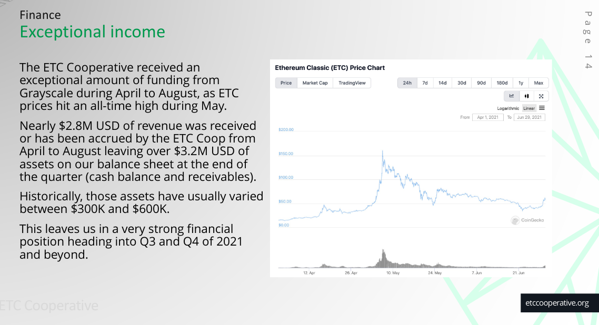

# Response to ETC Coop Withdrawing Support for ECIP-1098

2021.10.15

On September 20th 2021, a couple of weeks after *Let's Keep Ethereum Classic Classic* was published, Bob Summerwill, Executive Director of ETC Cooporative, informed the ETC community that The Coop have withdrawn their support for the existing ECIP-1098 Treasury proposal.

The announcement was [accompanied by a blog post](https://etccooperative.org/posts/2021-09-20-withdraws-support-for-ecip-1098) on the ETC Coop website, which we encourage interested readers to check out. We also recommend reviewing [the video debate between Bob Summerwill and Donald McIntyre](https://youtu.be/pzA4S9gZjvk) that discusses The Coop's withdrawal and provides some additional context to their decision.

Subsequently, [IOHK also announced](https://discord.com/channels/223674353001168906/223674353001168906/898565688707411978) their withdrawal of support for ECIP-1098.

## Due Credit

First and foremost we are grateful to Bob, ETC Coop and IOHK for updating the community with their decision, which enables the Treasury conversation to be moved along to its next stage, wherever that may be. The Coop's recommitment to transparency is also appreciated, and we look forward to it's continued maintenance and the engagement it facilitates.

In our view, this potentially difficult but necessary announcement demonstrates that ETC Coop is both tuned-in to community sentiment and has the humility and flexibility to correct course when required. For many ETC participants including ourselves, the decision has raised confidence in ETC Coop's current leadership, which continues to prove itself a positive force for Ethereum Classic.

## Ding, Dong, ECIP-1098 is Dead

It is our sense that without the support of ETC Coop or IOHK, major stewards and players in the ETC decision-making process, ECIP-1098 in its current form is extremely unlikely to be implemented; it is in Bob's words "[totally dead](https://youtu.be/pzA4S9gZjvk?t=3351)".

From our perspective this is certainly a positive development, but we will abstain from premature celebration as the withdrawal announcement is not necessarily the final nail in the Treasury's coffin.

According to the withdrawal announcement, ETC Coop believe that it is still necessary to implement a protocol-layer Treasury system on ETC, but wish to do so in a way that "can avoid the shortcomings of ECIP-1098". Whilst [for reasons we have explained previously](/) we are doubtful that a *protocol-layer* treasury system that is sufficiently decentralized could be conceived of, we won't jump to any conclusions about the viability of potential future proposals and must remain open to the possibility that this circle can be squared.

It is essential that the ETC decision-making process remains open to good proposals regardless of where they come from; transparently engaging with and judging ideas based on their merit alone. If a new proposal (Treasury or otherwise) is introduced by ECIP-1098's proponents, we hope that all participants engage and evaluate impartially, without being influenced by a love or hate for ECIP-1098.

With that being said, and with some additional context to engage with, we will respond to some points made in the withdrawal announcement and the video debate to help tee up discussion for the next chapter in ETC's story.

## Sweeping Problems (under the rug)

According to the withdrawal announcement, the primary reason for ECIP-1098 being rejected was a lack of consensus on how to solve the [ETC, not USD](/#etc-not-usd) problem, which was presumably being discussed in private by some Treasury proponents before the publication of *Let's Keep Ethereum Classic Classic*.

To remedy this problem, ETC Coop proposed a "sweeping mechanism" to cap the profits of Treasury Beneficiaries in the case that changes in ETC price and budget requirements caused over-funding. It appears that compromise was not acceptable to IOHK, leading to The Coop's withdrawal.

Whilst understandably outside the scope of the withdrawal announcement, we wish to make the point that fixing the over-funding problem alone would only address one of the Treasury's more egregious issues and still leaves many others on the table. If a new Treasury proposal is put forward, hopefully attempts will be made to tackle some of the other concerns we have highlighted previously.

We agree that a "sweeping mechanism" or similar system to cap private profits would *help* with this particular problem, but this solution still seems ripe for abuse, and introduces other issues to sort out. Without diving too deep, some obvious questions come to mind:

- How do participants come to consensus about how much budget is appropriate for each team?
- What mechanism forces teams to give back unused funds, other than good will?
- Assuming excess funds are "swept", where do they go?
- If excess funds go a community pot, does it suffer similar problems?

As opposed to limiting funding in the first place, sweeping seems less than ideal as the full upfront cost to network security via reduced miner rewards is still incurred, and while the dev tax could theoretically be returned to other miners post-sweep, this creates a distortion in the rewards schedule that introduces periods of relative vulnerability.

## The Bitcoin Standard

To presumably to counter the idea that Ethereum Classic should follow Bitcoin's treasuryless development funding model, the withdrawal announcement contrasts both projects:

> Unlike Bitcoin, which could likely be run pretty much “as is” in perpetuity, the Ethereum and ETC protocol and codebases need ongoing maintenance and protocol tweaking because of the added complexity of being a general computing platform. The crypto-economics are complicated and there is much more opportunity for attack vectors.

This point was also discussed in the [video debate](https://youtu.be/pzA4S9gZjvk?t=4675), where Bob further argues that ETC is not currently at the same stage as BTC, which being more popular and mature, has whales and companies building on top of it who are able to donate or otherwise contribute to client development.

We can at least agree that ETC and BTC are different beasts, and that ETC is likely to require more work in terms of basic upkeep due to its increased complexity and attack surface, as evidenced by recent vulnerability-fixing hard forks.

However, the idea that ETC can't follow BTC's funding model because it has additional maintenance requirements does not follow. It's clear that even without a treasury Bitcoin has attracted far more developer resources that would be required to meet ETC's basic needs - that those requirements are slightly different is not relevant. Bitcoin's treasuryless development model goes far beyond "the basics" and has delivered research and development culminating in the release of upgrades such as segwit, taproot and lightning network, which are no small feat and far beyond the devpower needed to keep ETC going.

From our perspective, highlighting the difference in maintenance difficulty between the two projects is a bit of a red herring, as the problem of meeting basic upkeep funding is primarily controlled by other factors, namely market cap.

Another of the larger differences at play between the two projects is that of maturity, with BTC being 12 years old and ETC existing for only 6. Fair enough that they do not have the same level of interest today, but BTC did not have a treasury 6 years ago either, and still managed to not just do basic upkeep but also garner contributions beyond the level that would be required for basic upkeep of ETC.

Indeed, in the video debate Bob later seems to agree with this, and speculates that at some point in the future, just like BTC, ETC will hopefully mature to the stage where it is big enough for whales/companies to be incentivized to donate resources; there'll so much cash floating around that financing basic upkeep is a non-issue.

This "Goldilocks Zone" of self-perpetuation is definitely where ETC wants to be, but [as we have argued](/#blockchain-seppuku), we believe that relies not *not* having a Treasury. Despite ETC's additional development burden, it is our belief that far from justifying the need for a protocol layer treasury, the correct takeaway from a comparison with Bitcoin is to try to emulate BTC's wild success more closely (potentially by [streamlining development](#the-next-chapter)), rather than further distancing ETC from this proven philosophical and development formula.

## The Goldilocks Zone

But hold on. Isn't ETC already in the Goldilocks Zone; this ideal of having whales and companies fund development sounds awfully similar to the current situation, no? 

While ETC is certainly in a less comfortable position than BTC in this regard, ETC Coop, at least, have a good amount of runway. Commendably, they publish their finances publicly, and their [most recent report](https://etccooperative.org/ETC-Coop-Board-Package-July-August-2021.pdf) shows they have about $3,200,000 in cash from (whale and company) Grayscale. This is the war chest of just one steward, and other players like ETC Labs have their own private reserves.

On top of this, it seems likely that as time goes on the cryptocurrency space including ETC will continue to expand, which will translate into larger market cap and more spare resources that can be dedicated to development, essential or otherwise. Even so, this is not a guarantee, and at this stage, unlike Bitcoin, ETC has not reached such an obvious level of self-perpetuation whereby it is difficult to see funding ever running out.

Whether ETC is in the Goldilocks Zone or not, recent price rises show that it is certainly travelling in the right direction. Reaching self-sustainability is in all likelihood a matter 'holding out' whilst maintaining trajectory, whereas disruptive moves like the implementation of a protocol layer Treasury run the real risk of knocking us off course.

## Innovation vs Implementation

Of all the factors that determine whether ETC will reach self-sustainability; existing war chests, future price fluctuations, coming and going of developers, natural contribution, etc, the one thing that is most directly controllable is *burn rate* - how much is spent in terms of monthly expenditure to keep essential development going.  

One major point of confusion surrounding the Treasury that [we tried to untangle previously](/#client-development-essential) was uncertainty about what was actually needed in terms of funding. The framing from some that the Treasury was meant to facilitate "innovation" brought into question the extent to which a Treasury was actually necessary for essential client maintenance.

Thankfully, [Bob settled this confusion](https://youtu.be/pzA4S9gZjvk?t=1898), and we agree that the real issue to be solved is not innovation per se, but implementation - in other words, if there are limited resources, it makes sense to spend them on things that are of critical importance, including keeping up the with EVM standard, fixing vulnerabilities, optimization, and client stability. For us, clarification on this point realigns expectations for the better.

## Moving On

The ECIP-1098 journey was long and bumpy. It brought out the best and the worst elements of Ethereum Classic. It caused many to question their beliefs about principles, pragmatism, motivations, leadership and strategy. It caused drama, uncertainty and rage-quits. It told the world ETC is a sinking ship.

Luckily, as an antifragile system, ETC gained from this disorder immensely. It persisted with yet another battle scar and has emerged the other side stronger and more mature, proving that once again that this cockroach can survive anything that is thrown at it. Somehow, along the way it even managed to 10x in market cap.

The main takeaway from this whole ordeal, from our perspective, is hopefully a collective recognition that controversial proposals are a non-starter. If supporters of a proposal are not willing to cause a chain split and consensus clearly cannot be reached, dragging things out only wastes time and energy. Having gone through this once, ETC now has a valuable reference point that will hopefully streamline decision-making forevermore, allowing similar proposals to fail quickly.

We hope that this new knowledge will be acted on, as after such a long period of uncertainty, ETC finds itself with a new zeitgeist and a new set of unanswered questions. The death of ECIP-1098 and the clarification around innovation vs implementation presents a great opportunity to provide ETCistan with a *State of the Union* address, and an update to the public roadmap so that all participants can once again consolidate and rally around a shared vision.

Of particular concerning for many stakeholders is the apparent disconnect between the clearly stated principles and ideals that ETC proports to represent and the contradictory reasoning of some of it's larger custodians. Even with the best of intentions, some of the more puritanical Ethereum Classic supporters will understandably show disdain for much of the messaging around any kind of protocol-layer Treasury - for them, it would be reassuring to know that decentralization remains a priority.

What is needed now is a refocus and recommitment to our universally accepted decentralist values to get the community back on the right footing, dispel the FUD, and push ETC forward to new heights. To this end, whilst we can accept that the withdrawal announcement does not guarantee the prevention of all future treasury proposals, we pray that for at least for the midterm the idea of implementing one remains on ice.

## The Next Chapter

During the Treausry kerfuffle, it is likely that some developers questioned "do I really want to deploy on a system that is still not sure what it wants to be?". Moreover, the Treausry directly brought into question whether or not ETC has enough funding to maintain itself for the mid to long term, which surely scared away some level adoption. The extent of this damage is unknown, but it should be a priority to correct any misconceptions caused by the Treasury narrative and restore confidence.

To allay these understandable fears and capture interest, we believe that what is most needed now is a strong message; a guarantee that ETC *can* support itself, it *will* survive long term even without a treasury, and that for the midterm at least, there will be a period of certainty and stability.

It's not our place to tell private organizations how spend their own budgets, nor would it be possible in a decentralized system like ETC, but with the Treasury off the table for now, it seems like a good time to be planning strategies that help guarantee that there is enough fuel in the tank to reach self-sustainability *à la* Bitcoin. If the goal is to maximize the probability of reaching this point, resources should be utilized efficiently so that basic client upkeep can be maintained for as long as possible.

What might this look like? Recent events provide an excellent opportunity to respond with an updated roadmap that takes into account this new environment. Again, it is not our role to hand down edicts, but hopefully the following questions can ignite discussion within the ETC community and help synthesize a strategy for the next phase of growth.

Is it possible to ringfence a budget that can (more or less) guarantee the basic upkeep of X clients for Y number of years, giving developers and contributors confidence that ETC is not going anywhere for the midterm? This does not mean removing all funding for feature upgrades, but it seems like it would be a mistake to sacrifice future years of long term support on present day risky ventures that may or may not pay off (or reach consensus).

We know it's not this simple, but would it be better to have 3 clients maintained for 2 years, or one client be maintained for 6? How many clients are *critical* to support ETC? Should ETC consider emulating Bitcoin's primary reference client success story, whereby one codebase receives *critical* funding, love and attention to detail, allowing [other third parties](https://en.bitcoin.it/wiki/Clients) to implement and innovate, with fewer guarantees, at their leisure? Would this approach enable a more streamlined development plan, allowing fixes and upgrades like SHA3 to be easier to tackle (rather than having to coordinate multiple clients)?

What are costs involved in *truly* essential client development? What is ETC's minimum necessary burn rate (with some margin for error)? Knowing this figure will go a long way in actually trying to solve funding issues if there are any, as it opens up more options to raising funds (with clearer requirements as opposed to an infinite upside money pit). Some of our [previous suggestions](/incentivized-voluntary-donations), we feel, would still be worth attempting if indeed there is a shortfall, and may, especially with price increases, become a sustainable source of funding that contributes to essential maintenance.

Should a top tier dev team such as ChainSafe issue limited edition NFTs on ETC in exchange for committing to N months of client development, for example, this author would certainly contribute.

## The Cockroach of Crypto

In all likelihood, in time, the Treasury saga, like the many bumps in the road that ETC has endured previously, will be looked back on with amusement as another one of those existential threats that rather than destroying ETC, revealed its antifragile nature and fueled its rise.

This outcome shows the world that, for ETC, those with the most resources, clout, or twitter followers, are not necessarily running the show; it shows that ETC is very resistant to takeover, and is instead guided by a force much more powerful than special interests - decentralized consensus.

Having stuck to its philosophical guns and further refining what kind of proposals are feasible, ETC has optimized its decision-making process and passed an important test in the eyes of many, gaining another feather in its cap and underlining its value proposition. Contrary to the *sinking ship* narrative, ETC is in fact one step closer to reaching the Goldilocks Zone in an actually decentralized and *therefore* self-sustainable way.

The heated conversation around that Treasury that shows that ETC is in good hands and in good health. Thanks to all involved, on both sides, for contributing in good faith and in such a civilized manner.

*Ordo Ab Chao*; from this recent chaos, order will emerge... eventually.
